# POC_ETH_TestNet_VBox201804
Instrucciones detalladas de la configuración de una TestNet de Ethereum en un cluster de 2 nodos + 1 bootnode en Virtualbox

# Creación de una Testnet Ethereum privada como laboratorio de pruebas

Basado en el blog:
[Setup your own private Proof-of-Authority Ethereum network with Geth]
(https://hackernoon.com/setup-your-own-private-proof-of-authority-ethereum-network-with-geth-9a0a3750cda8)


## Servidores (Virtualbox VM Layout)

* **ipfire (Firewall/NAT Gateway)**
    * ipfire219.testnet.org (en DHCP)
        * RED eth: (Variable DHCP)
        * GREEN eth:  10.0.0.1 / 24 (255.255.255.0)

* **labgethnode01**
    * **10.0.0.21** labgethnode01.example.es labgethnode01

* **labgethnode01**
    * **10.0.0.22** labgethnode02.example.es labgethnode02
    
* **labgethpuppeth**
    * **10.0.0.23** labgethpuppeth.example.es labgethpuppeth

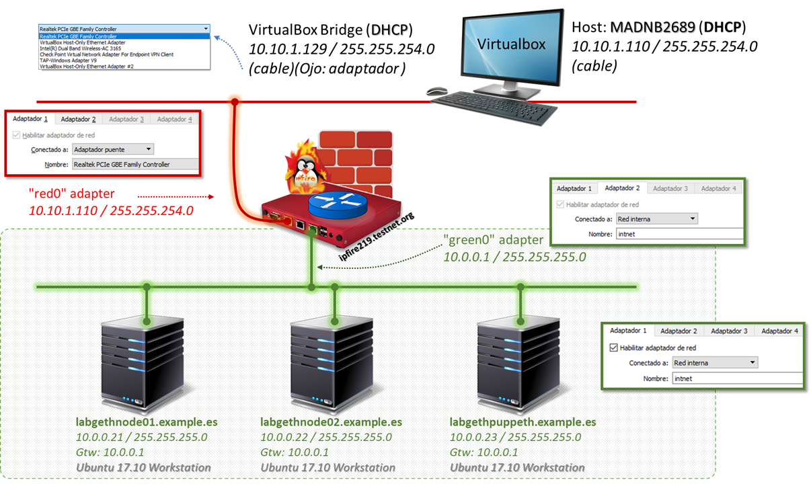

## Reglas de Firewall (NAT&SSH Port Forwarding from RED to GREEN)

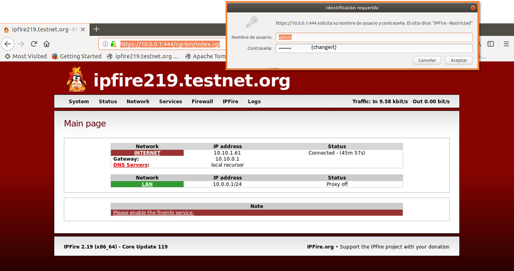
> ATENCION: [https://10.0.0.1:444/cgi-bin/firewall.cgi](https://10.0.0.1:444/cgi-bin/firewall.cgi) Solo accesible desde los ordenadores en la zona `GREEN`


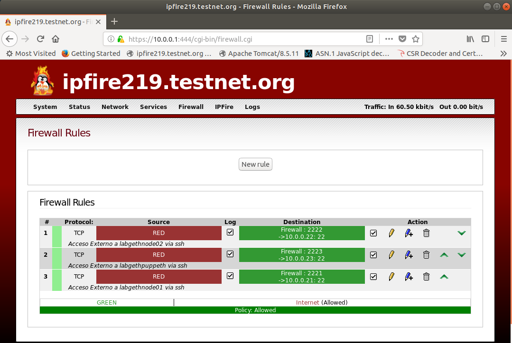


## Preliminares

>Nota: puede usarse desde el cliente ssh local del equipo host de virtualbox los comandos:
> 
>`ssh devel1@10.10.1.127 -p 2221` para **labgethnode01**
>
>`ssh devel1@10.10.1.127 -p 2222` para **labgethnode02**
>
>`ssh devel1@10.10.1.127 -p 2223` para **labgethnode02**
>
> la dirección **`10.10.1.127`** puede variar al tratarse de DHCP.


### Asegurar tener parados *en una primera fase* los servicios de firewall en los sistemas `labgethnode01`, `labgethnode02` y `labgethpuppeth` (como root)


```sh
# systemctl stop ufw

# systemctl disable ufw
Synchronizing state of ufw.service with SysV service script with /lib/systemd/systemd-sysv-install.
Executing: /lib/systemd/systemd-sysv-install disable ufw
```

### Preparar el acceso SSH vía clave RSA

#### En `labgethnode01`

```sh
$ ssh-keygen -t rsa -b 4096 -C "devel1@example.es"
Generating public/private rsa key pair.
Enter file in which to save the key (/home/devel1/.ssh/id_rsa): 
Enter passphrase (empty for no passphrase): 
Enter same passphrase again: 
Your identification has been saved in /home/devel1/.ssh/id_rsa.
Your public key has been saved in /home/devel1/.ssh/id_rsa.pub.
The key fingerprint is:
SHA256:yqA2doUqf6Ur9cEgbWclPEEF0ncjQoUSuZaEbKDBrAI devel1@example.es
The key's randomart image is:
+---[RSA 4096]----+
|=o .oB=*o        |
|E++ +.B + o      |
|+. o + * o .     |
|o . B.o          |
|.  +o=. S        |
|   o.++.         |
|. *..+o.         |
| =.oo .          |
|  .o..           |
+----[SHA256]-----+

$ cat .ssh/id_rsa.pub 
ssh-rsa AAAAB3NzaC1yc2EAAAADAQABAAACAQCT0lUjOwlSyBZjDsHS1o6Kau1heWuR1UP0sQZ45MhrjE4hN4EEUU76Xuyz++3zVDSU+q/7ZNKhvDGb9xqkphfXsqY86mNM0Pz0NCaAb+ZADaNjXu9rX1+2l9Q/THlCdoCjLtsX9VrFTjeF6LvGoZPGA1fXngq07QyWZrJf/5k67CYbyoQhPpMTdlxDLBdEtmzJgZZJHquS5LJb5UeAj1G3veK30yE1CZkz7FYD2GBPB7tTAmJVAerKLf/Da9+avzMiHI75z44m3UNWO7GRcwXi5bTHJdMsaqGR2WptGlusGRcvhMpt3Kjzfwu/lDbo2pO2L2ktl2oB2vrWi/sBMwadx36g2qKSHd7KpEXo7jm1URRm1wJb0phZPiGNmP/hP0e4v19kaNUshlLeuYrl+UTbIv0cL3+JcR5+SrjoA9krkbEidsdCvGrE80zfPCeoFf24lJMMGkznCRSChhnR16/5AOsXSFGZNmZcKCYEUUIfdMZXl0n8q6trXNeJTIElQt6Pm8ZV5DVEW7GSkn9aL+jJT/JSOKx6nFtvj1otJAL3l1zDvBm/ALlN7ZkBJR2RthY1FrB8Un8ZCAruv1veQTC53SY1nslgCPTk1//yF/JK+hPUcsq3ArX9lvwtXFCRDWBCRPmh1+uIPFXoh7tZOhVjNC2N1BsyWHsAcb1JMZgL6w== devel1@example.es

$ ssh-copy-id devel1@labgethnode02.example.es
/usr/bin/ssh-copy-id: INFO: attempting to log in with the new key(s), to filter out any that are already installed
/usr/bin/ssh-copy-id: INFO: 1 key(s) remain to be installed -- if you are prompted now it is to install the new keys
devel1@labgethnode02.example.es's password: 

Number of key(s) added: 1

Now try logging into the machine, with:   "ssh 'devel1@labgethnode02.example.es'"
and check to make sure that only the key(s) you wanted were added.

$ ssh-copy-id devel1@labgethpuppeth.example.es
/usr/bin/ssh-copy-id: INFO: attempting to log in with the new key(s), to filter out any that are already installed
/usr/bin/ssh-copy-id: INFO: 1 key(s) remain to be installed -- if you are prompted now it is to install the new keys
devel1@labgethpuppeth.example.es's password: 

Number of key(s) added: 1

Now try logging into the machine, with:   "ssh 'devel1@labgethpuppeth.example.es'"
and check to make sure that only the key(s) you wanted were added.
```

#### En `labgethnode02`

```sh
$ ssh-keygen -t rsa -b 4096 -C "devel1@example.es"
Generating public/private rsa key pair.
Enter file in which to save the key (/home/devel1/.ssh/id_rsa):
Enter passphrase (empty for no passphrase):
Enter same passphrase again:
Your identification has been saved in /home/devel1/.ssh/id_rsa.
Your public key has been saved in /home/devel1/.ssh/id_rsa.pub.
The key fingerprint is:
SHA256:1cIzEtbE51+6hQAcjsdvghF+O1hJ+aN5Gsy8SX15v9M devel1@example.es
The key's randomart image is:
+---[RSA 4096]----+
|        +=+o     |
|       o O*o.    |
|        = &=.    |
|         X *=   .|
|        S+++o+ = |
|          O+o * o|
|         . * . +o|
|          +   ..E|
|               .o|
+----[SHA256]-----+

$ cat .ssh/id_rsa.pub
ssh-rsa AAAAB3NzaC1yc2EAAAADAQABAAACAQCvQmwJDotQdFMQnvczv7ExBPPi608Mx/OhwVUGvunz6WHdegY8iTkRXGJJpGSFQ7LIZRF7GQzKOcFKO+zqcpi4Ywr9n/teUI0iKFcga5Dh/Bi0ABHSWagw5eUo7aozLL7fseLmUqeFtGZXYZaHsI8E7pyBpvcajQdGcAKOrXGHl19Nj+2fbCA8zt38T/T0eiIAQLm7leP+y/Jl+7inJt9+DlPLhtGorgrB0BE3EjlmZrRpwuYneXO/llVHp19rq+j1XS09+Tx9pac+467HAp6Swwt1o+RawGzrjPJpQH+2AA1g27wc5YqfqcNx/HqHK6FSHzozj1/DeIy7gggzwEnhTZfSB+y9kyx/3GRuyFgfemtArJ7ReFha/6Vxd/mjeBh57puYlLmGMca57fElhYXbGdMhtKVMihv5bz09LFEc9CcPZO2CmABpZKm5arg76FVkJXMe4YohH5WlCjgl4MnO3V0ZFoeHht//YruTSI5ewuhcVg7gjIDNw9jtKyghFEVDHZEaT2vS9Jy0mcGrw6NHvjQwgf7x2f2s81UsixgdlgZlbNbMba9OZoFniGiczjplXrBXyWT3MNnfE17+2Jw/0zL1sdjH+Zj/7wskUZbL/szuQlt0ykUZC9ar5gyy9HFxezUXDX/mrAvkb2kME6C6eY+AxcVos0Np6LFIBxOnNw== devel1@example.es

$ ssh-copy-id devel1@labgethnode01.example.es
/usr/bin/ssh-copy-id: INFO: Source of key(s) to be installed: "/home/devel1/.ssh/id_rsa.pub"
The authenticity of host 'labgethnode01.example.es (10.0.0.21)' can't be established.
ECDSA key fingerprint is SHA256:tdMn14sRokpZjZM8R3k3bJN8pvwYmFQty1uOeYjtw3M.
Are you sure you want to continue connecting (yes/no)? yes
/usr/bin/ssh-copy-id: INFO: attempting to log in with the new key(s), to filter out any that are already installed
/usr/bin/ssh-copy-id: INFO: 1 key(s) remain to be installed -- if you are prompted now it is to install the new keys
devel1@labgethnode01.example.es's password:

Number of key(s) added: 1

Now try logging into the machine, with:   "ssh 'devel1@labgethnode01.example.es'"
and check to make sure that only the key(s) you wanted were added.

$ ssh-copy-id devel1@labgethpuppeth.example.es
/usr/bin/ssh-copy-id: INFO: Source of key(s) to be installed: "/home/devel1/.ssh/id_rsa.pub"
The authenticity of host 'labgethpuppeth.example.es (10.0.0.23)' can't be established.
ECDSA key fingerprint is SHA256:UJ622y8iUGcd+y0hm0mXaiUQFVldeFZ3dFImiJp6LU8.
Are you sure you want to continue connecting (yes/no)? yes
/usr/bin/ssh-copy-id: INFO: attempting to log in with the new key(s), to filter out any that are already installed
/usr/bin/ssh-copy-id: INFO: 1 key(s) remain to be installed -- if you are prompted now it is to install the new keys
devel1@labgethpuppeth.example.es's password:

Number of key(s) added: 1

Now try logging into the machine, with:   "ssh 'devel1@labgethpuppeth.example.es'"
and check to make sure that only the key(s) you wanted were added.

```
#### En `labgethpuppeth`

```sh
$ ssh-keygen -t rsa -b 4096 -C "devel1@example.es"
Generating public/private rsa key pair.
Enter file in which to save the key (/home/devel1/.ssh/id_rsa):
Enter passphrase (empty for no passphrase):
Enter same passphrase again:
Your identification has been saved in /home/devel1/.ssh/id_rsa.
Your public key has been saved in /home/devel1/.ssh/id_rsa.pub.
The key fingerprint is:
SHA256:Xkz/BWKCB74erpaqnlCr0C3xNPxXCHjxaeeeOpIbDss devel1@example.es
The key's randomart image is:
+---[RSA 4096]----+
|      . .        |
|     . + +       |
|    . o * = o .  |
|   . . o O + . . |
|  o +   S = .   .|
| o * o + = . . . |
|o + + oo= o   .  |
|.o + +=+..       |
|..+.Eo+o..       |
+----[SHA256]-----+


$ cat .ssh/id_rsa.pub
ssh-rsa AAAAB3NzaC1yc2EAAAADAQABAAACAQDGLptTNeWrtOHxnhNzx/ybTC7R9G0WQJSBGYcXTovVSjFeIiQqPoRvzy4zpo4sjNNL4l/To0NFUO3l9hsqrkuxenGhicw1u11vyu2n6uwZMES4MaC8Rlns5DuMB4SCr3BbAOmnCSPZVAfom/YPySw3GRYBtmD7+6Gys0la0hDO772//JJfSdb41dD2rc06YVLWGeIopRMt1oZVFdebJDUUnrCLvubFV4jIod/GkzZe3uYaNEUS6V582zllW5GGNaI0S5RF9LrUP8/1nZ0yySq1wqFXCRhOrrj5aoDqQsRa8uR2OGv/06MeJe28T9o5o9XlGib1MJcIuHnVpEBh2MrMsdsm8NABG6xuKG+NR4VRLqShftYMDUtMM9noOk9Z62BYVPfBepDerC1nfV2uf7DaaCNyqkir4EuOeKTBRRsGtq7ZKZ91hlt8or3KFuj+W6SwpCjoHzRkt9CJkkwHemAuTM+QkO5FIapsfGDCLpSgWjmXgJhtNOjOQIGjgRFZuXaccEYWLlJckyZK88tHwOGdCK++h7+1f1YdLUaYkFGHBKsQZy0zEsxM9hsRiqk9vmfYNUgaPV53Ghy5v+e0RyQ7IapsYtkCasqJfNonSWUtCtxZZvum8TYt+mcZ94ur6RTvyYXFzcyk6Clqjuhl1u7+3RyA6MgfFiPCbHOBM8wwJw== devel1@example.es


$ ssh-copy-id devel1@labgethnode01.example.es
/usr/bin/ssh-copy-id: INFO: Source of key(s) to be installed: "/home/devel1/.ssh/id_rsa.pub"
The authenticity of host 'labgethnode01.example.es (10.0.0.21)' can't be established.
ECDSA key fingerprint is SHA256:tdMn14sRokpZjZM8R3k3bJN8pvwYmFQty1uOeYjtw3M.
Are you sure you want to continue connecting (yes/no)? yes
/usr/bin/ssh-copy-id: INFO: attempting to log in with the new key(s), to filter out any that are already installed
/usr/bin/ssh-copy-id: INFO: 1 key(s) remain to be installed -- if you are prompted now it is to install the new keys
devel1@labgethnode01.example.es's password:

Number of key(s) added: 1

Now try logging into the machine, with:   "ssh 'devel1@labgethnode01.example.es'"
and check to make sure that only the key(s) you wanted were added.

$ ssh-copy-id devel1@labgethnode02.example.es
/usr/bin/ssh-copy-id: INFO: Source of key(s) to be installed: "/home/devel1/.ssh/id_rsa.pub"
The authenticity of host 'labgethnode02.example.es (10.0.0.22)' can't be established.
ECDSA key fingerprint is SHA256:UJ622y8iUGcd+y0hm0mXaiUQFVldeFZ3dFImiJp6LU8.
Are you sure you want to continue connecting (yes/no)? yes
/usr/bin/ssh-copy-id: INFO: attempting to log in with the new key(s), to filter out any that are already installed
/usr/bin/ssh-copy-id: INFO: 1 key(s) remain to be installed -- if you are prompted now it is to install the new keys
devel1@labgethnode02.example.es's password:

Number of key(s) added: 1

Now try logging into the machine, with:   "ssh 'devel1@labgethnode02.example.es'"
and check to make sure that only the key(s) you wanted were added.
```
### Visualizar estado de las claves para el acceso SSH vía clave RSA desde los otros nodos:

#### En `labgethnode01`

```sh
$ ls -laR .ssh/

total 24
drwx------  2 devel1 devel1 4096 abr 25 17:42 .
drwxr-xr-x 23 devel1 devel1 4096 abr 25 15:11 ..
-rw-------  1 devel1 devel1 1486 abr 25 17:46 authorized_keys
-rw-------  1 devel1 devel1 3243 abr 25 15:12 id_rsa
-rw-r--r--  1 devel1 devel1  743 abr 25 15:12 id_rsa.pub
-rw-r--r--  1 devel1 devel1 1110 abr 25 13:49 known_hosts

$ cat .ssh/authorized_keys
ssh-rsa AAAAB3NzaC1yc2EAAAADAQABAAACAQCvQmwJDotQdFMQnvczv7ExBPPi608Mx/OhwVUGvunz6WHdegY8iTkRXGJJpGSFQ7LIZRF7GQzKOcFKO+zqcpi4Ywr9n/teUI0iKFcga5Dh/Bi0ABHSWagw5eUo7aozLL7fseLmUqeFtGZXYZaHsI8E7pyBpvcajQdGcAKOrXGHl19Nj+2fbCA8zt38T/T0eiIAQLm7leP+y/Jl+7inJt9+DlPLhtGorgrB0BE3EjlmZrRpwuYneXO/llVHp19rq+j1XS09+Tx9pac+467HAp6Swwt1o+RawGzrjPJpQH+2AA1g27wc5YqfqcNx/HqHK6FSHzozj1/DeIy7gggzwEnhTZfSB+y9kyx/3GRuyFgfemtArJ7ReFha/6Vxd/mjeBh57puYlLmGMca57fElhYXbGdMhtKVMihv5bz09LFEc9CcPZO2CmABpZKm5arg76FVkJXMe4YohH5WlCjgl4MnO3V0ZFoeHht//YruTSI5ewuhcVg7gjIDNw9jtKyghFEVDHZEaT2vS9Jy0mcGrw6NHvjQwgf7x2f2s81UsixgdlgZlbNbMba9OZoFniGiczjplXrBXyWT3MNnfE17+2Jw/0zL1sdjH+Zj/7wskUZbL/szuQlt0ykUZC9ar5gyy9HFxezUXDX/mrAvkb2kME6C6eY+AxcVos0Np6LFIBxOnNw== devel1@example.es
ssh-rsa AAAAB3NzaC1yc2EAAAADAQABAAACAQDGLptTNeWrtOHxnhNzx/ybTC7R9G0WQJSBGYcXTovVSjFeIiQqPoRvzy4zpo4sjNNL4l/To0NFUO3l9hsqrkuxenGhicw1u11vyu2n6uwZMES4MaC8Rlns5DuMB4SCr3BbAOmnCSPZVAfom/YPySw3GRYBtmD7+6Gys0la0hDO772//JJfSdb41dD2rc06YVLWGeIopRMt1oZVFdebJDUUnrCLvubFV4jIod/GkzZe3uYaNEUS6V582zllW5GGNaI0S5RF9LrUP8/1nZ0yySq1wqFXCRhOrrj5aoDqQsRa8uR2OGv/06MeJe28T9o5o9XlGib1MJcIuHnVpEBh2MrMsdsm8NABG6xuKG+NR4VRLqShftYMDUtMM9noOk9Z62BYVPfBepDerC1nfV2uf7DaaCNyqkir4EuOeKTBRRsGtq7ZKZ91hlt8or3KFuj+W6SwpCjoHzRkt9CJkkwHemAuTM+QkO5FIapsfGDCLpSgWjmXgJhtNOjOQIGjgRFZuXaccEYWLlJckyZK88tHwOGdCK++h7+1f1YdLUaYkFGHBKsQZy0zEsxM9hsRiqk9vmfYNUgaPV53Ghy5v+e0RyQ7IapsYtkCasqJfNonSWUtCtxZZvum8TYt+mcZ94ur6RTvyYXFzcyk6Clqjuhl1u7+3RyA6MgfFiPCbHOBM8wwJw== devel1@example.es
```

#### En `labgethnode02`

```sh
$ ls -la .ssh/
total 24
drwxrwxr-x 2 devel1 devel1 4096 abr 25 17:43 .
drwxr-xr-x 5 devel1 devel1 4096 abr 25 14:02 ..
-rw------- 1 devel1 devel1 1486 abr 25 17:47 authorized_keys
-rw------- 1 devel1 devel1 3243 abr 25 17:40 id_rsa
-rw-r--r-- 1 devel1 devel1  743 abr 25 17:40 id_rsa.pub
-rw-r--r-- 1 devel1 devel1  888 abr 25 17:43 known_hosts

$ cat .ssh/authorized_keys
ssh-rsa AAAAB3NzaC1yc2EAAAADAQABAAACAQCT0lUjOwlSyBZjDsHS1o6Kau1heWuR1UP0sQZ45MhrjE4hN4EEUU76Xuyz++3zVDSU+q/7ZNKhvDGb9xqkphfXsqY86mNM0Pz0NCaAb+ZADaNjXu9rX1+2l9Q/THlCdoCjLtsX9VrFTjeF6LvGoZPGA1fXngq07QyWZrJf/5k67CYbyoQhPpMTdlxDLBdEtmzJgZZJHquS5LJb5UeAj1G3veK30yE1CZkz7FYD2GBPB7tTAmJVAerKLf/Da9+avzMiHI75z44m3UNWO7GRcwXi5bTHJdMsaqGR2WptGlusGRcvhMpt3Kjzfwu/lDbo2pO2L2ktl2oB2vrWi/sBMwadx36g2qKSHd7KpEXo7jm1URRm1wJb0phZPiGNmP/hP0e4v19kaNUshlLeuYrl+UTbIv0cL3+JcR5+SrjoA9krkbEidsdCvGrE80zfPCeoFf24lJMMGkznCRSChhnR16/5AOsXSFGZNmZcKCYEUUIfdMZXl0n8q6trXNeJTIElQt6Pm8ZV5DVEW7GSkn9aL+jJT/JSOKx6nFtvj1otJAL3l1zDvBm/ALlN7ZkBJR2RthY1FrB8Un8ZCAruv1veQTC53SY1nslgCPTk1//yF/JK+hPUcsq3ArX9lvwtXFCRDWBCRPmh1+uIPFXoh7tZOhVjNC2N1BsyWHsAcb1JMZgL6w== devel1@example.es
ssh-rsa AAAAB3NzaC1yc2EAAAADAQABAAACAQDGLptTNeWrtOHxnhNzx/ybTC7R9G0WQJSBGYcXTovVSjFeIiQqPoRvzy4zpo4sjNNL4l/To0NFUO3l9hsqrkuxenGhicw1u11vyu2n6uwZMES4MaC8Rlns5DuMB4SCr3BbAOmnCSPZVAfom/YPySw3GRYBtmD7+6Gys0la0hDO772//JJfSdb41dD2rc06YVLWGeIopRMt1oZVFdebJDUUnrCLvubFV4jIod/GkzZe3uYaNEUS6V582zllW5GGNaI0S5RF9LrUP8/1nZ0yySq1wqFXCRhOrrj5aoDqQsRa8uR2OGv/06MeJe28T9o5o9XlGib1MJcIuHnVpEBh2MrMsdsm8NABG6xuKG+NR4VRLqShftYMDUtMM9noOk9Z62BYVPfBepDerC1nfV2uf7DaaCNyqkir4EuOeKTBRRsGtq7ZKZ91hlt8or3KFuj+W6SwpCjoHzRkt9CJkkwHemAuTM+QkO5FIapsfGDCLpSgWjmXgJhtNOjOQIGjgRFZuXaccEYWLlJckyZK88tHwOGdCK++h7+1f1YdLUaYkFGHBKsQZy0zEsxM9hsRiqk9vmfYNUgaPV53Ghy5v+e0RyQ7IapsYtkCasqJfNonSWUtCtxZZvum8TYt+mcZ94ur6RTvyYXFzcyk6Clqjuhl1u7+3RyA6MgfFiPCbHOBM8wwJw== devel1@example.es

```

#### En `labgethpuppeth`

```sh
$ ls -laR .ssh/
.ssh/:
total 24
drwx------ 2 devel1 devel1 4096 abr 25 17:47 .
drwxr-xr-x 5 devel1 devel1 4096 abr 13 11:44 ..
-rw------- 1 devel1 devel1 1486 abr 25 17:43 authorized_keys
-rw------- 1 devel1 devel1 3243 abr 25 17:44 id_rsa
-rw-r--r-- 1 devel1 devel1  743 abr 25 17:44 id_rsa.pub
-rw-r--r-- 1 devel1 devel1 1110 abr 25 17:47 known_hosts

$ cat .ssh/authorized_keys
ssh-rsa AAAAB3NzaC1yc2EAAAADAQABAAACAQCT0lUjOwlSyBZjDsHS1o6Kau1heWuR1UP0sQZ45MhrjE4hN4EEUU76Xuyz++3zVDSU+q/7ZNKhvDGb9xqkphfXsqY86mNM0Pz0NCaAb+ZADaNjXu9rX1+2l9Q/THlCdoCjLtsX9VrFTjeF6LvGoZPGA1fXngq07QyWZrJf/5k67CYbyoQhPpMTdlxDLBdEtmzJgZZJHquS5LJb5UeAj1G3veK30yE1CZkz7FYD2GBPB7tTAmJVAerKLf/Da9+avzMiHI75z44m3UNWO7GRcwXi5bTHJdMsaqGR2WptGlusGRcvhMpt3Kjzfwu/lDbo2pO2L2ktl2oB2vrWi/sBMwadx36g2qKSHd7KpEXo7jm1URRm1wJb0phZPiGNmP/hP0e4v19kaNUshlLeuYrl+UTbIv0cL3+JcR5+SrjoA9krkbEidsdCvGrE80zfPCeoFf24lJMMGkznCRSChhnR16/5AOsXSFGZNmZcKCYEUUIfdMZXl0n8q6trXNeJTIElQt6Pm8ZV5DVEW7GSkn9aL+jJT/JSOKx6nFtvj1otJAL3l1zDvBm/ALlN7ZkBJR2RthY1FrB8Un8ZCAruv1veQTC53SY1nslgCPTk1//yF/JK+hPUcsq3ArX9lvwtXFCRDWBCRPmh1+uIPFXoh7tZOhVjNC2N1BsyWHsAcb1JMZgL6w== devel1@example.es
ssh-rsa AAAAB3NzaC1yc2EAAAADAQABAAACAQCvQmwJDotQdFMQnvczv7ExBPPi608Mx/OhwVUGvunz6WHdegY8iTkRXGJJpGSFQ7LIZRF7GQzKOcFKO+zqcpi4Ywr9n/teUI0iKFcga5Dh/Bi0ABHSWagw5eUo7aozLL7fseLmUqeFtGZXYZaHsI8E7pyBpvcajQdGcAKOrXGHl19Nj+2fbCA8zt38T/T0eiIAQLm7leP+y/Jl+7inJt9+DlPLhtGorgrB0BE3EjlmZrRpwuYneXO/llVHp19rq+j1XS09+Tx9pac+467HAp6Swwt1o+RawGzrjPJpQH+2AA1g27wc5YqfqcNx/HqHK6FSHzozj1/DeIy7gggzwEnhTZfSB+y9kyx/3GRuyFgfemtArJ7ReFha/6Vxd/mjeBh57puYlLmGMca57fElhYXbGdMhtKVMihv5bz09LFEc9CcPZO2CmABpZKm5arg76FVkJXMe4YohH5WlCjgl4MnO3V0ZFoeHht//YruTSI5ewuhcVg7gjIDNw9jtKyghFEVDHZEaT2vS9Jy0mcGrw6NHvjQwgf7x2f2s81UsixgdlgZlbNbMba9OZoFniGiczjplXrBXyWT3MNnfE17+2Jw/0zL1sdjH+Zj/7wskUZbL/szuQlt0ykUZC9ar5gyy9HFxezUXDX/mrAvkb2kME6C6eY+AxcVos0Np6LFIBxOnNw== devel1@example.es
```

## Configuración de la testnet

### Paso 1. 
### Instalación y configuración de `eth-netstat` en `labgethpuppteh.example.es`

#### eth-netstat pre-requisites
[eth-netstats](https://github.com/cubedro/eth-netstats)

```
devel1@labgethpuppeth:~$ node --version
El programa «node» no está instalado. Puede instalarlo escribiendo:
sudo apt install nodejs

devel1@labgethpuppeth:~$ npm --help
El programa «npm» no está instalado. Puede instalarlo escribiendo:
sudo apt install npm

devel1@labgethpuppeth:~$ geth version
Geth
Version: 1.8.2-stable
Git Commit: b8b9f7f4476a30a0aaf6077daade6ae77f969960
Architecture: amd64
Protocol Versions: [63 62]
Network Id: 1
Go Version: go1.9.4
Operating System: linux
GOPATH=/home/devel1/golang/workspace
GOROOT=/usr/local/go

devel1@labgethpuppeth:~$ sudo apt install nodejs npm
[sudo] password for devel1:
Leyendo lista de paquetes... Hecho
Creando árbol de dependencias
Leyendo la información de estado... Hecho
Se instalarán los siguientes paquetes adicionales:
  gyp javascript-common libc-ares2 libjs-inherits libjs-jquery libjs-node-uuid libjs-underscore libssl1.0-dev libuv1 libuv1-dev node-abbrev node-ansi node-ansi-color-table node-archy node-async
  node-balanced-match node-block-stream node-brace-expansion node-builtin-modules node-combined-stream node-concat-map node-cookie-jar node-delayed-stream node-forever-agent node-form-data
  node-fs.realpath node-fstream node-fstream-ignore node-github-url-from-git node-glob node-graceful-fs node-gyp node-hosted-git-info node-inflight node-inherits node-ini node-is-builtin-module
  node-isexe node-json-stringify-safe node-lockfile node-lru-cache node-mime node-minimatch node-mkdirp node-mute-stream node-node-uuid node-nopt node-normalize-package-data node-npmlog node-once
  node-osenv node-path-is-absolute node-pseudomap node-qs node-read node-read-package-json node-request node-retry node-rimraf node-semver node-sha node-slide node-spdx-correct
  node-spdx-expression-parse node-spdx-license-ids node-tar node-tunnel-agent node-underscore node-validate-npm-package-license node-which node-wrappy node-yallist nodejs-dev nodejs-doc
  python-pkg-resources
Paquetes sugeridos:
  apache2 | lighttpd | httpd node-hawk node-aws-sign node-oauth-sign node-http-signature debhelper python-setuptools
Se instalarán los siguientes paquetes NUEVOS:
  gyp javascript-common libc-ares2 libjs-inherits libjs-jquery libjs-node-uuid libjs-underscore libssl1.0-dev libuv1 libuv1-dev node-abbrev node-ansi node-ansi-color-table node-archy node-async
  node-balanced-match node-block-stream node-brace-expansion node-builtin-modules node-combined-stream node-concat-map node-cookie-jar node-delayed-stream node-forever-agent node-form-data
  node-fs.realpath node-fstream node-fstream-ignore node-github-url-from-git node-glob node-graceful-fs node-gyp node-hosted-git-info node-inflight node-inherits node-ini node-is-builtin-module
  node-isexe node-json-stringify-safe node-lockfile node-lru-cache node-mime node-minimatch node-mkdirp node-mute-stream node-node-uuid node-nopt node-normalize-package-data node-npmlog node-once
  node-osenv node-path-is-absolute node-pseudomap node-qs node-read node-read-package-json node-request node-retry node-rimraf node-semver node-sha node-slide node-spdx-correct
  node-spdx-expression-parse node-spdx-license-ids node-tar node-tunnel-agent node-underscore node-validate-npm-package-license node-which node-wrappy node-yallist nodejs nodejs-dev nodejs-doc
  npm python-pkg-resources
0 actualizados, 77 nuevos se instalarán, 0 para eliminar y 27 no actualizados.
Se necesita descargar 7.429 kB de archivos.
Se utilizarán 37,2 MB de espacio de disco adicional después de esta operación.
¿Desea continuar? [S/n]

devel1@labgethpuppeth:~$ node --version
v6.11.4

devel1@labgethpuppeth:~$ npm --version
3.5.2
```
#### eth-netstat installation

```
devel1@labgethpuppeth:~$ mkdir ethtools
devel1@labgethpuppeth:~$ cd ethtools/
devel1@labgethpuppeth:~/ethtools$

devel1@labgethpuppeth:~/ethtools$ git --version
git version 2.14.1
devel1@labgethpuppeth:~/ethtools$ git clone https://github.com/cubedro/eth-netstats
Clonar en «eth-netstats»...
remote: Counting objects: 3657, done.
remote: Total 3657 (delta 0), reused 0 (delta 0), pack-reused 3656
Receiving objects: 100% (3657/3657), 7.36 MiB | 340.00 KiB/s, done.
Resolving deltas: 100% (2119/2119), done.

devel1@labgethpuppeth:~/ethtools$ cd eth-netstats/
devel1@labgethpuppeth:~/ethtools/eth-netstats$ npm install
devel1@labgethpuppeth:~/ethtools/eth-netstats$ npm install
npm WARN deprecated jade@1.11.0: Jade has been renamed to pug, please install the latest version of pug instead of jade
npm WARN deprecated minimatch@0.3.0: Please update to minimatch 3.0.2 or higher to avoid a RegExp DoS issue
npm WARN deprecated graceful-fs@1.1.14: please upgrade to graceful-fs 4 for compatibility with current and future versions of Node.js
npm WARN deprecated graceful-fs@3.0.11: please upgrade to graceful-fs 4 for compatibility with current and future versions of Node.js
npm WARN deprecated natives@1.1.3: This module relies on Node.js's internals and will break at some point. Do not use it, and update to graceful-fs@4.x.
npm WARN deprecated minimatch@0.2.14: Please update to minimatch 3.0.2 or higher to avoid a RegExp DoS issue
npm WARN deprecated coffee-script@1.3.3: CoffeeScript on NPM has moved to "coffeescript" (no hyphen)
npm WARN deprecated graceful-fs@1.2.3: please upgrade to graceful-fs 4 for compatibility with current and future versions of Node.js
npm WARN deprecated jade@1.9.2: Jade has been renamed to pug, please install the latest version of pug instead of jade
npm WARN deprecated constantinople@3.0.2: Please update to at least constantinople 3.1.1
npm WARN deprecated transformers@2.1.0: Deprecated, use jstransformer
eth-netstats@0.0.9 /home/devel1/ethtools/eth-netstats
├─┬ body-parser@1.13.3
│ ├── bytes@2.1.0
│ ├── content-type@1.0.4
│ ├── depd@1.0.1
│ ├─┬ http-errors@1.3.1
│ │ ├── inherits@2.0.3
│ │ └── statuses@1.5.0
│ ├── iconv-lite@0.4.11
│ ├─┬ on-finished@2.3.0
│ │ └── ee-first@1.1.1
│ ├── qs@4.0.0
│ ├─┬ raw-body@2.1.7
│ │ ├── bytes@2.4.0
│ │ ├── iconv-lite@0.4.13
│ │ └── unpipe@1.0.0
│ └─┬ type-is@1.6.16
│   ├── media-typer@0.3.0
│   └─┬ mime-types@2.1.18
│     └── mime-db@1.33.0
├─┬ chalk@1.1.1
│ ├── ansi-styles@2.2.1
│ ├── escape-string-regexp@1.0.5
│ ├─┬ has-ansi@2.0.0
│ │ └── ansi-regex@2.1.1
│ ├── strip-ansi@3.0.1
│ └── supports-color@2.0.0
├── d3@3.5.6
├─┬ debug@2.2.0
│ └── ms@0.7.1
├─┬ express@4.13.3
│ ├─┬ accepts@1.2.13
│ │ └── negotiator@0.5.3
│ ├── array-flatten@1.1.1
│ ├── content-disposition@0.5.0
│ ├── cookie@0.1.3
│ ├── cookie-signature@1.0.6
│ ├── escape-html@1.0.2
│ ├── etag@1.7.0
│ ├── finalhandler@0.4.0
│ ├── fresh@0.3.0
│ ├── merge-descriptors@1.0.0
│ ├── methods@1.1.2
│ ├── parseurl@1.3.2
│ ├── path-to-regexp@0.1.7
│ ├─┬ proxy-addr@1.0.10
│ │ ├── forwarded@0.1.2
│ │ └── ipaddr.js@1.0.5
│ ├── range-parser@1.0.3
│ ├─┬ send@0.13.0
│ │ ├── destroy@1.0.3
│ │ ├── mime@1.3.4
│ │ └── statuses@1.2.1
│ ├─┬ serve-static@1.10.3
│ │ ├── escape-html@1.0.3
│ │ └─┬ send@0.13.2
│ │   ├── depd@1.1.2
│ │   ├── destroy@1.0.4
│ │   └── statuses@1.2.1
│ ├── utils-merge@1.0.0
│ └── vary@1.0.1
├─┬ geoip-lite@1.1.6
│ ├── async@0.1.22
│ ├── colors@0.6.0-1
│ ├─┬ glob@3.2.11
│ │ └── minimatch@0.3.0
│ ├── lazy@1.0.11
│ ├─┬ rimraf@2.0.3
│ │ └── graceful-fs@1.1.14
│ └─┬ unzip@0.0.4
│   ├─┬ binary@0.3.0
│   │ ├── buffers@0.1.1
│   │ └─┬ chainsaw@0.1.0
│   │   └── traverse@0.3.9
│   ├─┬ fstream@0.1.31
│   │ └─┬ graceful-fs@3.0.11
│   │   └── natives@1.1.3
│   └─┬ pullstream@0.0.4
│     ├── over@0.0.5
│     └── stream-buffers@0.2.6
├─┬ grunt@0.4.5
│ ├── coffee-script@1.3.3
│ ├── colors@0.6.2
│ ├── dateformat@1.0.2-1.2.3
│ ├── eventemitter2@0.4.14
│ ├── exit@0.1.2
│ ├─┬ findup-sync@0.1.3
│ │ └── lodash@2.4.2
│ ├── getobject@0.1.0
│ ├─┬ glob@3.1.21
│ │ ├── graceful-fs@1.2.3
│ │ └── inherits@1.0.2
│ ├─┬ grunt-legacy-log@0.1.3
│ │ ├── colors@0.6.2
│ │ ├─┬ grunt-legacy-log-utils@0.1.1
│ │ │ ├── colors@0.6.2
│ │ │ ├── lodash@2.4.2
│ │ │ └── underscore.string@2.3.3
│ │ ├── lodash@2.4.2
│ │ └── underscore.string@2.3.3
│ ├─┬ grunt-legacy-util@0.2.0
│ │ └── lodash@0.9.2
│ ├── hooker@0.2.3
│ ├── iconv-lite@0.2.11
│ ├─┬ js-yaml@2.0.5
│ │ ├─┬ argparse@0.1.16
│ │ │ ├── underscore@1.7.0
│ │ │ └── underscore.string@2.4.0
│ │ └── esprima@1.0.4
│ ├── lodash@0.9.2
│ ├─┬ minimatch@0.2.14
│ │ ├── lru-cache@2.7.3
│ │ └── sigmund@1.0.1
│ ├─┬ nopt@1.0.10
│ │ └── abbrev@1.1.1
│ ├── rimraf@2.2.8
│ ├── underscore.string@2.2.1
│ └── which@1.0.9
├─┬ grunt-contrib-clean@0.6.0
│ └── rimraf@2.2.8
├─┬ grunt-contrib-concat@0.5.1
│ ├─┬ chalk@0.5.1
│ │ ├── ansi-styles@1.1.0
│ │ ├─┬ has-ansi@0.1.0
│ │ │ └── ansi-regex@0.2.1
│ │ ├── strip-ansi@0.3.0
│ │ └── supports-color@0.2.0
│ └─┬ source-map@0.3.0
│   └── amdefine@1.0.1
├─┬ grunt-contrib-copy@0.8.2
│ └── file-sync-cmp@0.1.1
├─┬ grunt-contrib-cssmin@0.12.3
│ ├─┬ clean-css@3.4.28
│ │ ├─┬ commander@2.8.1
│ │ │ └── graceful-readlink@1.0.1
│ │ └── source-map@0.4.4
│ └─┬ maxmin@1.1.0
│   ├─┬ figures@1.7.0
│   │ └── object-assign@4.1.1
│   ├─┬ gzip-size@1.0.0
│   │ ├─┬ browserify-zlib@0.1.4
│   │ │ └── pako@0.2.9
│   │ └─┬ concat-stream@1.6.2
│   │   ├── buffer-from@1.0.0
│   │   ├─┬ readable-stream@2.3.6
│   │   │ ├── core-util-is@1.0.2
│   │   │ ├── isarray@1.0.0
│   │   │ ├── process-nextick-args@2.0.0
│   │   │ ├── safe-buffer@5.1.2
│   │   │ ├── string_decoder@1.1.1
│   │   │ └── util-deprecate@1.0.2
│   │   └── typedarray@0.0.6
│   └─┬ pretty-bytes@1.0.4
│     ├── get-stdin@4.0.1
│     └─┬ meow@3.7.0
│       ├─┬ camelcase-keys@2.1.0
│       │ └── camelcase@2.1.1
│       ├─┬ loud-rejection@1.6.0
│       │ ├─┬ currently-unhandled@0.4.1
│       │ │ └── array-find-index@1.0.2
│       │ └── signal-exit@3.0.2
│       ├── map-obj@1.0.1
│       ├── minimist@1.2.0
│       ├─┬ normalize-package-data@2.4.0
│       │ ├── hosted-git-info@2.6.0
│       │ ├─┬ is-builtin-module@1.0.0
│       │ │ └── builtin-modules@1.1.1
│       │ ├── semver@5.5.0
│       │ └─┬ validate-npm-package-license@3.0.3
│       │   ├─┬ spdx-correct@3.0.0
│       │   │ └── spdx-license-ids@3.0.0
│       │   └─┬ spdx-expression-parse@3.0.0
│       │     └── spdx-exceptions@2.1.0
│       ├─┬ read-pkg-up@1.0.1
│       │ ├─┬ find-up@1.1.2
│       │ │ ├── path-exists@2.1.0
│       │ │ └─┬ pinkie-promise@2.0.1
│       │ │   └── pinkie@2.0.4
│       │ └─┬ read-pkg@1.1.0
│       │   ├─┬ load-json-file@1.1.0
│       │   │ ├── graceful-fs@4.1.11
│       │   │ ├─┬ parse-json@2.2.0
│       │   │ │ └─┬ error-ex@1.3.1
│       │   │ │   └── is-arrayish@0.2.1
│       │   │ ├── pify@2.3.0
│       │   │ └─┬ strip-bom@2.0.0
│       │   │   └── is-utf8@0.2.1
│       │   └─┬ path-type@1.1.0
│       │     └── graceful-fs@4.1.11
│       ├─┬ redent@1.0.0
│       │ ├─┬ indent-string@2.1.0
│       │ │ └─┬ repeating@2.0.1
│       │ │   └─┬ is-finite@1.0.2
│       │ │     └── number-is-nan@1.0.1
│       │ └── strip-indent@1.0.1
│       └── trim-newlines@1.0.0
├─┬ grunt-contrib-jade@0.14.1
│ ├─┬ chalk@0.5.1
│ │ ├── ansi-styles@1.1.0
│ │ ├─┬ has-ansi@0.1.0
│ │ │ └── ansi-regex@0.2.1
│ │ ├── strip-ansi@0.3.0
│ │ └── supports-color@0.2.0
│ └─┬ jade@1.9.2
│   └── commander@2.6.0
├─┬ grunt-contrib-uglify@0.9.2
│ ├─┬ uglify-js@2.8.29
│ │ ├── source-map@0.5.7
│ │ ├── uglify-to-browserify@1.0.2
│ │ └─┬ yargs@3.10.0
│ │   ├── camelcase@1.2.1
│ │   ├─┬ cliui@2.1.0
│ │   │ ├─┬ center-align@0.1.3
│ │   │ │ ├─┬ align-text@0.1.4
│ │   │ │ │ ├─┬ kind-of@3.2.2
│ │   │ │ │ │ └── is-buffer@1.1.6
│ │   │ │ │ ├── longest@1.0.1
│ │   │ │ │ └── repeat-string@1.6.1
│ │   │ │ └── lazy-cache@1.0.4
│ │   │ ├── right-align@0.1.3
│ │   │ └── wordwrap@0.0.2
│ │   ├── decamelize@1.2.0
│ │   └── window-size@0.1.0
│ └── uri-path@0.0.2
├─┬ jade@1.11.0
│ ├── character-parser@1.2.1
│ ├── commander@2.6.0
│ ├─┬ constantinople@3.0.2
│ │ └── acorn@2.7.0
│ ├─┬ jstransformer@0.0.2
│ │ ├── is-promise@2.1.0
│ │ └─┬ promise@6.1.0
│ │   └── asap@1.0.0
│ ├─┬ mkdirp@0.5.1
│ │ └── minimist@0.0.8
│ ├─┬ transformers@2.1.0
│ │ ├─┬ css@1.0.8
│ │ │ ├── css-parse@1.0.4
│ │ │ └── css-stringify@1.0.5
│ │ ├─┬ promise@2.0.0
│ │ │ └── is-promise@1.0.1
│ │ └─┬ uglify-js@2.2.5
│ │   ├─┬ optimist@0.3.7
│ │   │ └── wordwrap@0.0.3
│ │   └── source-map@0.1.43
│ ├─┬ uglify-js@2.8.29
│ │ └── source-map@0.5.7
│ ├── void-elements@2.0.1
│ └─┬ with@4.0.3
│   ├── acorn@1.2.2
│   └── acorn-globals@1.0.9
├── lodash@3.10.1
├─┬ primus@6.1.0
│ ├─┬ access-control@1.0.0
│ │ ├── millisecond@0.1.2
│ │ └── vary@1.1.2
│ ├── asyncemit@3.0.1
│ ├─┬ create-server@1.0.1
│ │ └── connected@0.0.2
│ ├─┬ diagnostics@1.1.0
│ │ ├─┬ colorspace@1.0.1
│ │ │ ├─┬ color@0.8.0
│ │ │ │ ├── color-convert@0.5.3
│ │ │ │ └─┬ color-string@0.3.0
│ │ │ │   └── color-name@1.1.3
│ │ │ └── text-hex@0.0.0
│ │ ├─┬ enabled@1.0.2
│ │ │ └── env-variable@0.0.4
│ │ └─┬ kuler@0.0.0
│ │   └── colornames@0.0.2
│ ├── eventemitter3@2.0.3
│ ├── forwarded-for@1.0.1
│ ├─┬ fusing@1.0.0
│ │ ├── emits@3.0.0
│ │ └─┬ predefine@0.1.2
│ │   └── extendible@0.1.1
│ ├─┬ setheader@0.0.4
│ │ └── debug@0.7.4
│ ├── ultron@1.1.1
│ └── yeast@0.1.2
├── primus-emit@1.0.0
├── primus-spark-latency@0.1.1
└─┬ ws@1.1.5
  ├── options@0.0.6
  └── ultron@1.0.2


devel1@labgethpuppeth:~/ethtools/eth-netstats$ grunt
El programa «grunt» no está instalado. Puede instalarlo escribiendo:
sudo apt install node-grunt-cli

devel1@labgethpuppeth:~/ethtools/eth-netstats$ sudo apt install node-grunt-cli
Leyendo lista de paquetes... Hecho
Creando árbol de dependencias
Leyendo la información de estado... Hecho
Se instalarán los siguientes paquetes adicionales:
  node-amdefine node-arr-diff node-arr-flatten node-arr-union node-array-unique node-base node-braces node-cache-base node-class-utils node-collection-visit node-component-emitter
  node-copy-descriptor node-css node-debug node-define-property node-detect-file node-expand-brackets node-expand-tilde node-extend-shallow node-extglob node-filename-regex node-fill-range
  node-findup-sync node-for-in node-for-own node-fragment-cache node-fs-exists-sync node-get-value node-glob-base node-glob-parent node-global-modules node-global-prefix node-grunt-known-options
  node-has-value node-has-values node-is-accessor-descriptor node-is-buffer node-is-data-descriptor node-is-descriptor node-is-dotfile node-is-equal-shallow node-is-extendable node-is-extglob
  node-is-glob node-is-number node-is-plain-object node-is-primitive node-is-windows node-isarray node-isobject node-kind-of node-lazy-cache node-map-cache node-map-visit node-micromatch
  node-mixin-deep node-normalize-path node-object-copy node-object-visit node-object.omit node-parse-glob node-pascalcase node-posix-character-classes node-regex-cache node-regex-not
  node-repeat-element node-repeat-string node-resolve node-resolve-dir node-set-getter node-set-value node-snapdragon node-source-map node-static-extend node-to-object-path node-to-regex
  node-to-regex-range node-union-value node-unset-value node-use
Se instalarán los siguientes paquetes NUEVOS:
  node-amdefine node-arr-diff node-arr-flatten node-arr-union node-array-unique node-base node-braces node-cache-base node-class-utils node-collection-visit node-component-emitter
  node-copy-descriptor node-css node-debug node-define-property node-detect-file node-expand-brackets node-expand-tilde node-extend-shallow node-extglob node-filename-regex node-fill-range
  node-findup-sync node-for-in node-for-own node-fragment-cache node-fs-exists-sync node-get-value node-glob-base node-glob-parent node-global-modules node-global-prefix node-grunt-cli
  node-grunt-known-options node-has-value node-has-values node-is-accessor-descriptor node-is-buffer node-is-data-descriptor node-is-descriptor node-is-dotfile node-is-equal-shallow
  node-is-extendable node-is-extglob node-is-glob node-is-number node-is-plain-object node-is-primitive node-is-windows node-isarray node-isobject node-kind-of node-lazy-cache node-map-cache
  node-map-visit node-micromatch node-mixin-deep node-normalize-path node-object-copy node-object-visit node-object.omit node-parse-glob node-pascalcase node-posix-character-classes
  node-regex-cache node-regex-not node-repeat-element node-repeat-string node-resolve node-resolve-dir node-set-getter node-set-value node-snapdragon node-source-map node-static-extend
  node-to-object-path node-to-regex node-to-regex-range node-union-value node-unset-value node-use
0 actualizados, 81 nuevos se instalarán, 0 para eliminar y 27 no actualizados.
Se necesita descargar 460 kB de archivos.
Se utilizarán 2.094 kB de espacio de disco adicional después de esta operación.
¿Desea continuar? [S/n]

devel1@labgethpuppeth:~/ethtools/eth-netstats$ grunt
Running "clean:build" (clean) task
>> 0 paths cleaned.

Running "clean:cleanup_js" (clean) task
>> 0 paths cleaned.

Running "clean:cleanup_css" (clean) task
>> 0 paths cleaned.

Running "jade:build" (jade) task
>> 1 file created.

Running "copy:build" (copy) task
Copied 31 files

Running "cssmin:build" (cssmin) task
>> 2 files created. 33.36 kB → 30.53 kB

Running "concat:vendor" (concat) task
File dist/js/vendor.min.js created.

Running "concat:scripts" (concat) task
File dist/js/app.js created.

Running "uglify:app" (uglify) task
>> 1 file created.

Running "concat:netstats" (concat) task
File dist/js/netstats.min.js created.

Running "concat:css" (concat) task
File dist/css/netstats.min.css created.

Running "clean:cleanup_js" (clean) task
>> 3 paths cleaned.

Running "clean:cleanup_css" (clean) task
>> 4 paths cleaned.

Done, without errors.

```

#### eth-netstat run

##### Primeras pruebas

```
devel1@labgethpuppeth:~/ethtools/eth-netstats$ npm start

> eth-netstats@0.0.9 start /home/devel1/ethtools/eth-netstats
> node ./bin/www

2018-04-26 10:53:33.994 [API] WS_SECRET NOT SET!!!

(CTRL + C)

devel1@labgethpuppeth:~/ethtools/eth-netstats$ export WS_SECRET=changeit
devel1@labgethpuppeth:~/ethtools/eth-netstats$ npm start

> eth-netstats@0.0.9 start /home/devel1/ethtools/eth-netstats
> node ./bin/www
```

#### eth-netstat interface 

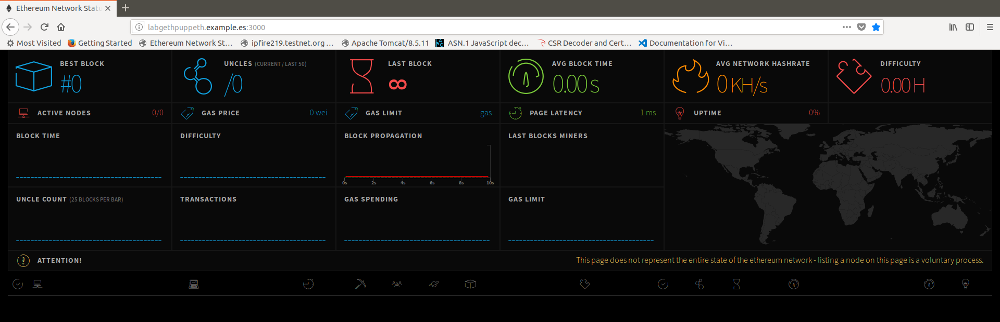

##### formalización

Se crea un script de arranque para poder invocarlo desde un `systemd service`:

```
devel1@labgethpuppeth:~/ethtools/eth-netstats$ vim eth-netstats_start.sh

devel1@labgethpuppeth:~/ethtools/eth-netstats$ chmod ugo+x eth-netstats_start.sh

devel1@labgethpuppeth:~/ethtools/eth-netstats$ more eth-netstats_start.sh

#!/bin/bash
export PORT=3000
export WS_SECRET=changeit
npm start
```

#### prueba de funcionamiento
```
devel1@labgethpuppeth:~/ethtools/eth-netstats$ ./eth-netstats_start.sh

> eth-netstats@0.0.9 start /home/devel1/ethtools/eth-netstats
> node ./bin/www

^C (CTRL + C)
```

```
devel1@labgethpuppeth:~/ethtools/eth-netstats$ su -
Contraseña:

root@labgethpuppeth:~# cd /etc/systemd/
network/ system/  user/

root@labgethpuppeth:~# cd /etc/systemd/system

root@labgethpuppeth:/etc/systemd/system# ls
dbus-org.freedesktop.resolve1.service  final.target.wants  graphical.target.wants  multi-user.target.wants         paths.target.wants    sshd.service          syslog.service
default.target.wants                   getty.target.wants  iscsi.service           open-vm-tools.service.requires  sockets.target.wants  sysinit.target.wants  timers.target.wants

root@labgethpuppeth:/etc/systemd/system# vim eth-netstats.service

root@labgethpuppeth:/etc/systemd/system# cat eth-netstats.service
[Unit]
Description=Ethereum Network Stats (visual interface for tracking ethereum network status)
After=syslog.target network.target

[Service]
Type=simple
User=devel1
Group=devel1
UMask=0007
WorkingDirectory=/home/devel1/ethtools/eth-netstats

ExecStart=/home/devel1/ethtools/eth-netstats/eth-netstats_start.sh
ExecStop=/usr/bin/kill -15 $MAINPID

SuccessExitStatus=143
RestartPreventExitStatus=143

LimitNOFILE=102642

[Install]
WantedBy=multi-user.target

root@labgethpuppeth:/etc/systemd/system# systemctl enable !$
systemctl enable eth-netstats.service
Created symlink /etc/systemd/system/multi-user.target.wants/eth-netstats.service → /etc/systemd/system/eth-netstats.service.

root@labgethpuppeth:/etc/systemd/system# systemctl start eth-netstats.service
root@labgethpuppeth:/etc/systemd/system# systemctl status eth-netstats.service
● eth-netstats.service - Ethereum Network Stats (visual interface for tracking ethereum network status)
   Loaded: loaded (/etc/systemd/system/eth-netstats.service; enabled; vendor preset: enabled)
   Active: active (running) since Thu 2018-04-26 14:04:41 CEST; 8s ago
 Main PID: 20881 (eth-netstats_st)
    Tasks: 18 (limit: 4915)
   Memory: 114.9M
      CPU: 928ms
   CGroup: /system.slice/eth-netstats.service
           ├─20881 /bin/bash /home/devel1/ethtools/eth-netstats/eth-netstats_start.sh
           ├─20882 npm
           ├─20905 sh -c node ./bin/www
           └─20906 node ./bin/www

abr 26 14:04:41 labgethpuppeth systemd[1]: Started Ethereum Network Stats (visual interface for tracking ethereum network status).
abr 26 14:04:41 labgethpuppeth eth-netstats_start.sh[20881]: > eth-netstats@0.0.9 start /home/devel1/ethtools/eth-netstats
abr 26 14:04:41 labgethpuppeth eth-netstats_start.sh[20881]: > node ./bin/www

root@labgethpuppeth:/etc/systemd/system# systemctl stop eth-netstats.service

root@labgethpuppeth:/etc/systemd/system# systemctl status eth-netstats.service
● eth-netstats.service - Ethereum Network Stats (visual interface for tracking ethereum network status)
   Loaded: loaded (/etc/systemd/system/eth-netstats.service; enabled; vendor preset: enabled)
   Active: failed (Result: exit-code) since Thu 2018-04-26 14:07:01 CEST; 6s ago
  Process: 20923 ExecStop=/usr/bin/kill -15 $MAINPID (code=exited, status=203/EXEC)
  Process: 20881 ExecStart=/home/devel1/ethtools/eth-netstats/eth-netstats_start.sh (code=killed, signal=TERM)
 Main PID: 20881 (code=killed, signal=TERM)
      CPU: 1.167s

abr 26 14:04:41 labgethpuppeth systemd[1]: Started Ethereum Network Stats (visual interface for tracking ethereum network status).
abr 26 14:04:41 labgethpuppeth eth-netstats_start.sh[20881]: > eth-netstats@0.0.9 start /home/devel1/ethtools/eth-netstats
abr 26 14:04:41 labgethpuppeth eth-netstats_start.sh[20881]: > node ./bin/www
abr 26 14:07:01 labgethpuppeth systemd[1]: Stopping Ethereum Network Stats (visual interface for tracking ethereum network status)...
abr 26 14:07:01 labgethpuppeth systemd[20923]: eth-netstats.service: Failed at step EXEC spawning /usr/bin/kill: No such file or directory
abr 26 14:07:01 labgethpuppeth systemd[1]: eth-netstats.service: Control process exited, code=exited status=203
abr 26 14:07:01 labgethpuppeth systemd[1]: Stopped Ethereum Network Stats (visual interface for tracking ethereum network status).
abr 26 14:07:01 labgethpuppeth systemd[1]: eth-netstats.service: Unit entered failed state.
abr 26 14:07:01 labgethpuppeth systemd[1]: eth-netstats.service: Failed with result 'exit-code'.


root@labgethpuppeth:/etc/systemd/system# lsof -iTCP -sTCP:LISTEN -P -n
COMMAND    PID            USER   FD   TYPE DEVICE SIZE/OFF NODE NAME
systemd-r  693 systemd-resolve   12u  IPv4  15673      0t0  TCP *:5355 (LISTEN)
systemd-r  693 systemd-resolve   14u  IPv6  15676      0t0  TCP *:5355 (LISTEN)
sshd      1131            root    3u  IPv4  18622      0t0  TCP *:22 (LISTEN)
sshd      1131            root    4u  IPv6  18637      0t0  TCP *:22 (LISTEN)
```

### Paso 2. 
### Creación de cuentas iniciales para los nodos `labgethnode01.example.es`y `labgethnode02.example.es`

#### en labgethnode01.example.es:

```
devel1@labgethnode01:~$ mkdir ethtestnet

devel1@labgethnode01:~$ mkdir ethtestnetlogs

devel1@labgethnode01:~$ geth --datadir ethtestnet/ account new 
INFO [04-26|16:23:20] Maximum peer count                       ETH=25 LES=0 total=25
Your new account is locked with a password. Please give a password. Do not forget this password.
Passphrase: 
Repeat passphrase: 
Address: {d0df65de6c9b8fa9521935c3611df13cb4895802}
devel1@labgethnode01:~$ geth --datadir ethtestnet/ account new 
INFO [04-26|16:23:55] Maximum peer count                       ETH=25 LES=0 total=25
Your new account is locked with a password. Please give a password. Do not forget this password.
Passphrase: 
Repeat passphrase: 
Address: {1536884ea30f24bbff2b6030dcc90c2ecdced4fc}
devel1@labgethnode01:~$ geth --datadir ethtestnet/ account new 
INFO [04-26|16:24:10] Maximum peer count                       ETH=25 LES=0 total=25
Your new account is locked with a password. Please give a password. Do not forget this password.
Passphrase: 
Repeat passphrase: 
Address: {7d262955c0e4eb8f80ea988f4412e93d9695bb7c}
devel1@labgethnode01:~$ geth --datadir ethtestnet/ account new 
INFO [04-26|16:24:25] Maximum peer count                       ETH=25 LES=0 total=25
Your new account is locked with a password. Please give a password. Do not forget this password.
Passphrase: 
Repeat passphrase: 
Address: {9e59b472ff876de463b382ac0de031e53470dbea}
devel1@labgethnode01:~$ geth --datadir ethtestnet/ account new 
INFO [04-26|16:24:43] Maximum peer count                       ETH=25 LES=0 total=25
Your new account is locked with a password. Please give a password. Do not forget this password.
Passphrase: 
Repeat passphrase: 
Address: {286058891661b295a295dc61ff8215f70e9bcde0}
devel1@labgethnode01:~$ geth --datadir ethtestnet/ account new 
INFO [04-26|16:24:54] Maximum peer count                       ETH=25 LES=0 total=25
Your new account is locked with a password. Please give a password. Do not forget this password.
Passphrase: 
Repeat passphrase: 
Address: {f9a35f5b9779d07cd3959e1fbc8387bf80c7896b}
```
>Nota: password: **pwdnode01**

```
$ ls -laR ethtestnet/
ethtestnet/:
total 12
drwxrwxr-x  3 devel1 devel1 4096 abr 26 16:23 .
drwxr-xr-x 24 devel1 devel1 4096 abr 26 16:22 ..
drwx------  2 devel1 devel1 4096 abr 26 16:25 keystore

ethtestnet/keystore:
total 32
drwx------ 2 devel1 devel1 4096 abr 26 16:25 .
drwxrwxr-x 3 devel1 devel1 4096 abr 26 16:23 ..
-rw------- 1 devel1 devel1  491 abr 26 16:23 UTC--2018-04-26T14-23-38.144276398Z--d0df65de6c9b8fa9521935c3611df13cb4895802
-rw------- 1 devel1 devel1  491 abr 26 16:24 UTC--2018-04-26T14-24-06.165275616Z--1536884ea30f24bbff2b6030dcc90c2ecdced4fc
-rw------- 1 devel1 devel1  491 abr 26 16:24 UTC--2018-04-26T14-24-18.793940969Z--7d262955c0e4eb8f80ea988f4412e93d9695bb7c
-rw------- 1 devel1 devel1  491 abr 26 16:24 UTC--2018-04-26T14-24-37.588345386Z--9e59b472ff876de463b382ac0de031e53470dbea
-rw------- 1 devel1 devel1  491 abr 26 16:24 UTC--2018-04-26T14-24-50.282115564Z--286058891661b295a295dc61ff8215f70e9bcde0
-rw------- 1 devel1 devel1  491 abr 26 16:25 UTC--2018-04-26T14-25-02.715511822Z--f9a35f5b9779d07cd3959e1fbc8387bf80c7896b

$ more ethtestnet/keystore/UTC--2018-04-26T14-23-38.144276398Z--d0df65de6c9b8fa9521935c3611df13cb4895802 
{"address":"d0df65de6c9b8fa9521935c3611df13cb4895802","crypto":{"cipher":"aes-128-ctr","ciphertext":"423e73237c1e3f577fb6d77e1c88f6b219c90c7d5eb1fa3ee433de81d164f2e7","cipherparams":{"iv":"926abf3b054ff8fdb59c14
a653dac48d"},"kdf":"scrypt","kdfparams":{"dklen":32,"n":262144,"p":1,"r":8,"salt":"abc3ca7538ad24d83e50fef237d6b7dc335e500fc883e9b35af0acb5cf8b5670"},"mac":"f2709b26401683dcf0f1c1a32adb550d2c62d72aab880e913b518f
b76dff3594"},"id":"abdca65a-11fb-49bf-9f60-e525002ce3a5","version":3}

```

```
{
    "address": "d0df65de6c9b8fa9521935c3611df13cb4895802",
    "crypto": {
        "cipher": "aes-128-ctr",
        "ciphertext": "423e73237c1e3f577fb6d77e1c88f6b219c90c7d5eb1fa3ee433de81d164f2e7",
        "cipherparams": {
            "iv": "926abf3b054ff8fdb59c14a653dac48d"
        },
        "kdf": "scrypt",
        "kdfparams": {
            "dklen": 32,
            "n": 262144,
            "p": 1,
            "r": 8,
            "salt": "abc3ca7538ad24d83e50fef237d6b7dc335e500fc883e9b35af0acb5cf8b5670"
        },
        "mac": "f2709b26401683dcf0f1c1a32adb550d2c62d72aab880e913b518f\r\nb76dff3594"
    },
    "id": "abdca65a-11fb-49bf-9f60-e525002ce3a5",
    "version": 3
}

```

#### en labgethnode02.example.es:

```
devel1@labgethnode02:~$ mkdir ethtestnet

devel1@labgethnode01:~$ mkdir ethtestnetlogs

devel1@labgethnode02:~$ geth --datadir ethtestnet/ account new
INFO [04-26|16:32:17] Maximum peer count                       ETH=25 LES=0 total=25
Your new account is locked with a password. Please give a password. Do not forget this password.
Passphrase:
Repeat passphrase:
Address: {d4a6dced76798668672ce8181b9a6855dd6da50e}
devel1@labgethnode02:~$ geth --datadir ethtestnet/ account new
INFO [04-26|16:32:52] Maximum peer count                       ETH=25 LES=0 total=25
Your new account is locked with a password. Please give a password. Do not forget this password.
Passphrase:
Repeat passphrase:
Address: {acd40701edc23515e220197f2c6781982795e70f}
devel1@labgethnode02:~$ geth --datadir ethtestnet/ account new
INFO [04-26|16:33:04] Maximum peer count                       ETH=25 LES=0 total=25
Your new account is locked with a password. Please give a password. Do not forget this password.
Passphrase:
Repeat passphrase:
Address: {e3f78eb3665fc8154497e706798906ad0e6ee48c}
devel1@labgethnode02:~$ geth --datadir ethtestnet/ account new
INFO [04-26|16:33:16] Maximum peer count                       ETH=25 LES=0 total=25
Your new account is locked with a password. Please give a password. Do not forget this password.
Passphrase:
Repeat passphrase:
Address: {b6dd996e394e99169394a8cf2324f2f44c6512cd}
devel1@labgethnode02:~$ geth --datadir ethtestnet/ account new
INFO [04-26|16:33:29] Maximum peer count                       ETH=25 LES=0 total=25
Your new account is locked with a password. Please give a password. Do not forget this password.
Passphrase:
Repeat passphrase:
Address: {2fabde5df9aac510048b9fc8765a50e613d86217}
devel1@labgethnode02:~$ geth --datadir ethtestnet/ account new
INFO [04-26|16:33:53] Maximum peer count                       ETH=25 LES=0 total=25
Your new account is locked with a password. Please give a password. Do not forget this password.
Passphrase:
Repeat passphrase:
Address: {8cebe844ab1a59c33d4c75b1077d33c3ef516493}
devel1@labgethnode02:~$ geth --datadir ethtestnet/ account new
INFO [04-26|16:34:04] Maximum peer count                       ETH=25 LES=0 total=25
Your new account is locked with a password. Please give a password. Do not forget this password.
Passphrase:
Repeat passphrase:
Address: {7350b107ab4181ce63bb0f2d6600fa98f0cc6eb0}
```

>Nota: password: **pwdnode02**

```
devel1@labgethnode02:~$ ls -laR ethtestnet/
ethtestnet/:
total 12
drwxrwxr-x 3 devel1 devel1 4096 abr 26 16:32 .
drwxr-xr-x 6 devel1 devel1 4096 abr 26 16:32 ..
drwx------ 2 devel1 devel1 4096 abr 26 16:34 keystore

ethtestnet/keystore:
total 36
drwx------ 2 devel1 devel1 4096 abr 26 16:34 .
drwxrwxr-x 3 devel1 devel1 4096 abr 26 16:32 ..
-rw------- 1 devel1 devel1  491 abr 26 16:32 UTC--2018-04-26T14-32-27.364835164Z--d4a6dced76798668672ce8181b9a6855dd6da50e
-rw------- 1 devel1 devel1  491 abr 26 16:33 UTC--2018-04-26T14-33-00.118914055Z--acd40701edc23515e220197f2c6781982795e70f
-rw------- 1 devel1 devel1  491 abr 26 16:33 UTC--2018-04-26T14-33-11.298680143Z--e3f78eb3665fc8154497e706798906ad0e6ee48c
-rw------- 1 devel1 devel1  491 abr 26 16:33 UTC--2018-04-26T14-33-24.463597174Z--b6dd996e394e99169394a8cf2324f2f44c6512cd
-rw------- 1 devel1 devel1  491 abr 26 16:33 UTC--2018-04-26T14-33-46.339650653Z--2fabde5df9aac510048b9fc8765a50e613d86217
-rw------- 1 devel1 devel1  491 abr 26 16:34 UTC--2018-04-26T14-34-01.346478930Z--8cebe844ab1a59c33d4c75b1077d33c3ef516493
-rw------- 1 devel1 devel1  491 abr 26 16:34 UTC--2018-04-26T14-34-11.925388830Z--7350b107ab4181ce63bb0f2d6600fa98f0cc6eb0
```

### Paso 3. 
### Creación del fichero con el bloque génesis (`Genesis file`) mediante `puppeth` en `labgethpuppeth.example.es` y su réplica en `labgethnode01.example.es`y `labgethnode02.example.es`

```
devel1@labgethpuppeth:~$ mkdir ethtestnet
devel1@labgethpuppeth:~$ cd ethtestnet/
devel1@labgethpuppeth:~/ethtestnet$

devel1@labgethpuppeth:~/ethtestnet$ puppeth
+-----------------------------------------------------------+
| Welcome to puppeth, your Ethereum private network manager |
|                                                           |
| This tool lets you create a new Ethereum network down to  |
| the genesis block, bootnodes, miners and ethstats servers |
| without the hassle that it would normally entail.         |
|                                                           |
| Puppeth uses SSH to dial in to remote servers, and builds |
| its network components out of Docker containers using the |
| docker-compose toolset.                                   |
+-----------------------------------------------------------+

Please specify a network name to administer (no spaces or hyphens, please)
> testnet

Sweet, you can set this via --network=testnet next time!

INFO [04-26|17:11:14] Administering Ethereum network           name=testnet
WARN [04-26|17:11:14] No previous configurations found         path=/home/devel1/.puppeth/testnet

What would you like to do? (default = stats)
 1. Show network stats
 2. Configure new genesis
 3. Track new remote server
 4. Deploy network components
> 2

Which consensus engine to use? (default = clique)
 1. Ethash - proof-of-work
 2. Clique - proof-of-authority
> 1

What would you like to do? (default = stats)
 1. Show network stats
 2. Configure new genesis
 3. Track new remote server
 4. Deploy network components
> 2

Which consensus engine to use? (default = clique)
 1. Ethash - proof-of-work
 2. Clique - proof-of-authority
> 1

Which accounts should be pre-funded? (advisable at least one)
> 0xd0df65de6c9b8fa9521935c3611df13cb4895802
> 0x1536884ea30f24bbff2b6030dcc90c2ecdced4fc
> 0x7d262955c0e4eb8f80ea988f4412e93d9695bb7c
> 0x9e59b472ff876de463b382ac0de031e53470dbea
> 0x286058891661b295a295dc61ff8215f70e9bcde0
> 0xf9a35f5b9779d07cd3959e1fbc8387bf80c7896b
> 0xd4a6dced76798668672ce8181b9a6855dd6da50e
> 0xacd40701edc23515e220197f2c6781982795e70f
> 0xe3f78eb3665fc8154497e706798906ad0e6ee48c
> 0xb6dd996e394e99169394a8cf2324f2f44c6512cd
> 0x2fabde5df9aac510048b9fc8765a50e613d86217
> 0x8cebe844ab1a59c33d4c75b1077d33c3ef516493
> 0x7350b107ab4181ce63bb0f2d6600fa98f0cc6eb0
> 0x

Specify your chain/network ID if you want an explicit one (default = random)
>
INFO [04-26|17:16:36] Configured new genesis block

What would you like to do? (default = stats)
 1. Show network stats
 2. Manage existing genesis
 3. Track new remote server
 4. Deploy network components
> 2

 1. Modify existing fork rules
 2. Export genesis configuration
 3. Remove genesis configuration
> 2

Which file to save the genesis into? (default = testnet.json)
> genesis.json
INFO [04-26|17:18:28] Exported existing genesis block

What would you like to do? (default = stats)
 1. Show network stats
 2. Manage existing genesis
 3. Track new remote server
 4. Deploy network components
> ^C (CTRL + C)


devel1@labgethpuppeth:~/ethtestnet$ ls
genesis.json
```

#### Copia a `labgethnode01.example.es` y `labgethnode03.example.es` en la carpeta `/home/devel1/ethtestnet/`

```
devel1@labgethpuppeth:~/ethtestnet$ scp genesis.json devel1@labgethnode01.example.es:/home/devel1/ethtestnet/
genesis.json                                                                                                                                                       100%   23KB  12.7MB/s   00:00
devel1@labgethpuppeth:~/ethtestnet$ scp genesis.json devel1@labgethnode02.example.es:/home/devel1/ethtestnet/
genesis.json
```

### Paso 4. 
### Inicialización de los nodos `labgethnode01.example.es`y `labgethnode02.example.es`  con el bloque génesis (`Genesis file`) generado:


#### En `labgethnode01.example.es`

```sh
devel1@labgethnode01:~$ pwd
/home/devel1

devel1@labgethnode01:~$ geth --identity "testnetnode01" --datadir $HOME/ethtestnet/ init $HOME/ethtestnet/genesis.json
INFO [04-27|09:59:18] Maximum peer count                       ETH=25 LES=0 total=25
INFO [04-27|09:59:18] Allocated cache and file handles         database=/home/devel1/ethtestnet/geth/chaindata cache=16 handles=16
INFO [04-27|09:59:18] Persisted trie from memory database      nodes=371 size=68.66kB time=617.019µs gcnodes=0 gcsize=0.00B gctime=0s livenodes=1 livesize=0.00B
INFO [04-27|09:59:18] Successfully wrote genesis state         database=chaindata                              hash=f20455…4e6204
INFO [04-27|09:59:18] Allocated cache and file handles         database=/home/devel1/ethtestnet/geth/lightchaindata cache=16 handles=16
INFO [04-27|09:59:18] Persisted trie from memory database      nodes=371 size=68.66kB time=468.434µs gcnodes=0 gcsize=0.00B gctime=0s livenodes=1 livesize=0.00B
INFO [04-27|09:59:18] Successfully wrote genesis state         database=lightchaindata                              hash=f20455…4e6204

devel1@labgethnode01:~/ethtestnet$ tree
.
├── accounts.txt
├── genesis.json
├── geth
│   ├── chaindata
│   │   ├── 000002.ldb
│   │   ├── 000003.log
│   │   ├── CURRENT
│   │   ├── LOCK
│   │   ├── LOG
│   │   └── MANIFEST-000004
│   └── lightchaindata
│       ├── 000002.ldb
│       ├── 000003.log
│       ├── CURRENT
│       ├── LOCK
│       ├── LOG
│       └── MANIFEST-000004
├── keystore
│   ├── UTC--2018-04-26T14-23-38.144276398Z--d0df65de6c9b8fa9521935c3611df13cb4895802
│   ├── UTC--2018-04-26T14-24-06.165275616Z--1536884ea30f24bbff2b6030dcc90c2ecdced4fc
│   ├── UTC--2018-04-26T14-24-18.793940969Z--7d262955c0e4eb8f80ea988f4412e93d9695bb7c
│   ├── UTC--2018-04-26T14-24-37.588345386Z--9e59b472ff876de463b382ac0de031e53470dbea
│   ├── UTC--2018-04-26T14-24-50.282115564Z--286058891661b295a295dc61ff8215f70e9bcde0
│   └── UTC--2018-04-26T14-25-02.715511822Z--f9a35f5b9779d07cd3959e1fbc8387bf80c7896b
└── password.txt

4 directories, 21 files

```

#### En `labgethnode02.example.es`

```sh
devel1@labgethnode02:~$ pwd
/home/devel1
devel1@labgethnode02:~$ geth --identity "testnetnode02" --datadir $HOME/ethtestnet/ init $HOME/ethtestnet/genesis.json
INFO [04-27|10:04:52] Maximum peer count                       ETH=25 LES=0 total=25
INFO [04-27|10:04:52] Allocated cache and file handles         database=/home/devel1/ethtestnet/geth/chaindata cache=16 handles=16
INFO [04-27|10:04:52] Writing custom genesis block
INFO [04-27|10:04:52] Persisted trie from memory database      nodes=371 size=68.66kB time=2.276925ms gcnodes=0 gcsize=0.00B gctime=0s livenodes=1 livesize=0.00B
INFO [04-27|10:04:52] Successfully wrote genesis state         database=chaindata                              hash=f20455…4e6204
INFO [04-27|10:04:52] Allocated cache and file handles         database=/home/devel1/ethtestnet/geth/lightchaindata cache=16 handles=16
INFO [04-27|10:04:52] Writing custom genesis block
INFO [04-27|10:04:52] Persisted trie from memory database      nodes=371 size=68.66kB time=1.157048ms gcnodes=0 gcsize=0.00B gctime=0s livenodes=1 livesize=0.00B
INFO [04-27|10:04:52] Successfully wrote genesis state         database=lightchaindata                              hash=f20455…4e6204

devel1@labgethnode02:~$ cd ethtestnet/

devel1@labgethnode02:~/ethtestnet$ tree
.
├── accounts.txt
├── genesis.json
├── geth
│   ├── chaindata
│   │   ├── 000001.log
│   │   ├── CURRENT
│   │   ├── LOCK
│   │   ├── LOG
│   │   └── MANIFEST-000000
│   └── lightchaindata
│       ├── 000001.log
│       ├── CURRENT
│       ├── LOCK
│       ├── LOG
│       └── MANIFEST-000000
├── keystore
│   ├── UTC--2018-04-26T14-32-27.364835164Z--d4a6dced76798668672ce8181b9a6855dd6da50e
│   ├── UTC--2018-04-26T14-33-00.118914055Z--acd40701edc23515e220197f2c6781982795e70f
│   ├── UTC--2018-04-26T14-33-11.298680143Z--e3f78eb3665fc8154497e706798906ad0e6ee48c
│   ├── UTC--2018-04-26T14-33-24.463597174Z--b6dd996e394e99169394a8cf2324f2f44c6512cd
│   ├── UTC--2018-04-26T14-33-46.339650653Z--2fabde5df9aac510048b9fc8765a50e613d86217
│   ├── UTC--2018-04-26T14-34-01.346478930Z--8cebe844ab1a59c33d4c75b1077d33c3ef516493
│   └── UTC--2018-04-26T14-34-11.925388830Z--7350b107ab4181ce63bb0f2d6600fa98f0cc6eb0
└── password.txt
```


### Paso 5. 
### Creación y arranque de un `bootnode` en `labgethpuppeth.example.es`:


#### Creación y generación del archivo de clave `boot.key`

```sh
devel1@labgethpuppeth:~$ bootnode --help
Usage of bootnode:
  -addr string
        listen address (default ":30301")
  -genkey string
        generate a node key
  -nat string
        port mapping mechanism (any|none|upnp|pmp|extip:<IP>) (default "none")
  -netrestrict string
        restrict network communication to the given IP networks (CIDR masks)
  -nodekey string
        private key filename
  -nodekeyhex string
        private key as hex (for testing)
  -v5
        run a v5 topic discovery bootnode
  -verbosity int
        log verbosity (0-9) (default 3)
  -vmodule string
        log verbosity pattern
  -writeaddress
        write out the node's pubkey hash and quit
devel1@labgethpuppeth:~$ tree ~/ethtestnet/
/home/devel1/ethtestnet/
└── genesis.json

0 directories, 1 file

devel1@labgethpuppeth:~$ bootnode -genkey ~/ethtestnet/boot.key

devel1@labgethpuppeth:~$ bootnode -nodekey ~/ethtestnet/boot.key -writeaddress
d037519c2b3eaa87b46c968c86b6e5ce3e692412f8a603e737841e0e70dac3579cca3d44e3ae4229274a3fb527d9ee01628478dd64194c87c586a4b8fec20703

devel1@labgethpuppeth:~$ tree ~/ethtestnet/
/home/devel1/ethtestnet/
├── boot.key
└── genesis.json

0 directories, 2 files

devel1@labgethpuppeth:~$ more ~/ethtestnet/boot.key
b597602fc24eb534e64b116855067a6a3e1393d73d38645a3beae0153b4a54f5

```
#### Prueba de arranque:

```
devel1@labgethpuppeth:~$ bootnode -nodekey ~/ethtestnet/boot.key -verbosity 9 -addr :30310
INFO [04-27|11:55:45] UDP listener up                          self=enode://d037519c2b3eaa87b46c968c86b6e5ce3e692412f8a603e737841e0e70dac3579cca3d44e3ae4229274a3fb527d9ee01628478dd64194c87c586a4b8fec20703@[::]:30310
```

#### Reorganizamos directorio `ethtestnet` para incluir un subdirectorio `bootnode` dedicado a los datos, script de arranque y logs del `bootnode` y probamos un nuevo arranque:

```sh
devel1@labgethpuppeth:~$ mkdir -pv ethtestnet/bootnode/logs
mkdir: se ha creado el directorio 'ethtestnet/bootnode'
mkdir: se ha creado el directorio 'ethtestnet/bootnode/logs'
devel1@labgethpuppeth:~$ mv ethtestnet/boot.key ethtestnet/bootnode/ --verbose
'ethtestnet/boot.key' -> 'ethtestnet/bootnode/boot.key'
devel1@labgethpuppeth:~$ tree ethtestnet/
ethtestnet/
├── bootnode
│   ├── boot.key
│   └── logs
└── genesis.json

2 directories, 2 files
devel1@labgethpuppeth:~$ bootnode -nodekey ~/ethtestnet/bootnode/boot.key -verbosity 9 -addr :30310
INFO [04-27|11:59:57] UDP listener up                          self=enode://d037519c2b3eaa87b46c968c86b6e5ce3e692412f8a603e737841e0e70dac3579cca3d44e3ae4229274a3fb527d9ee01628478dd64194c87c586a4b8fec20703@[::]:30310
```

#### Preparación y prueba de un script de arranque

```sh
devel1@labgethpuppeth:~/ethtestnet/bootnode$ vim bootnode_start.sh

devel1@labgethpuppeth:~/ethtestnet/bootnode$ cat bootnode_start.sh

#!/bin/bash
export CURRENT_TIME=$(date +%Y%m%d%H%M%S)
export LISTEN_PORT=30310
export BOOTNODE_HOME=/home/devel1/ethtestnet/bootnode
export BOOTKEY_PATH=${BOOTNODE_HOME}/boot.key
bootnode -nodekey ${BOOTKEY_PATH} -verbosity 9 -addr :${LISTEN_PORT} 1>> ${BOOTNODE_HOME}/logs/bootnode_"${CURRENT_TIME}".log  2>> ${BOOTNODE_HOME}/logs/bootnode_"${CURRENT_TIME}".error
```

#### Preparación y prueba de un servicio de arranque (como root)

```sh
root@labgethpuppeth:/etc/systemd/system# vim eth-bootnode.service

root@labgethpuppeth:/etc/systemd/system# cat eth-bootnode.service
[Unit]
Description=Ethereum Network Bootnode (Bootnode de la Testnet)
After=syslog.target network.target

[Service]
Type=simple
User=devel1
Group=devel1
UMask=0007
WorkingDirectory=/home/devel1/ethtestnet/bootnode

ExecStart=/home/devel1/ethtestnet/bootnode/bootnode_start.sh
ExecStop=/usr/bin/kill -15 $MAINPID

SuccessExitStatus=143
RestartPreventExitStatus=143

LimitNOFILE=102642

[Install]
WantedBy=multi-user.target


root@labgethpuppeth:/etc/systemd/system# systemctl enable eth-bootnode.service
Created symlink /etc/systemd/system/multi-user.target.wants/eth-bootnode.service → /etc/systemd/system/eth-bootnode.service.

root@labgethpuppeth:/etc/systemd/system# systemctl start eth-bootnode.service
root@labgethpuppeth:/etc/systemd/system# systemctl status eth-bootnode.service
● eth-bootnode.service - Ethereum Network Bootnode (Bootnode de la Testnet)
   Loaded: loaded (/etc/systemd/system/eth-bootnode.service; enabled; vendor preset: enabled)
   Active: active (running) since Fri 2018-04-27 12:29:29 CEST; 5s ago
 Main PID: 2734 (bootnode_start.)
    Tasks: 7 (limit: 4915)
   Memory: 4.5M
      CPU: 35ms
   CGroup: /system.slice/eth-bootnode.service
           ├─2734 /bin/bash /home/devel1/ethtestnet/bootnode/bootnode_start.sh
           └─2746 bootnode -nodekey /home/devel1/ethtestnet/bootnode/boot.key -verbosity 9 -addr :30310

abr 27 12:29:29 labgethpuppeth systemd[1]: Started Ethereum Network Bootnode (Bootnode de la Testnet).

root@labgethpuppeth:/etc/systemd/system# ls /home/devel1/ethtestnet/bootnode/logs/ -la
total 16
drwxrwxr-x 2 devel1 devel1 4096 abr 27 12:29 .
drwxrwxr-x 3 devel1 devel1 4096 abr 27 12:19 ..
-rw-rw-r-- 1 devel1 devel1  216 abr 27 12:18 bootnode_20180427121827.error
-rw-rw-r-- 1 devel1 devel1    0 abr 27 12:18 bootnode_20180427121827.log
-rw-rw---- 1 devel1 devel1  216 abr 27 12:29 bootnode_20180427122929.error
-rw-rw---- 1 devel1 devel1    0 abr 27 12:29 bootnode_20180427122929.log

root@labgethpuppeth:/etc/systemd/system# more /home/devel1/ethtestnet/bootnode/logs/bootnode_20180427122929.error
INFO [04-27|12:29:29] UDP listener up                          self=enode://d037519c2b3eaa87b46c968c86b6e5ce3e692412f8a603e737841e0e70dac3579cca3d44e3ae4229274a3fb527d9ee01628478dd64194c87c586a4b8f
ec20703@[::]:30310

root@labgethpuppeth:/etc/systemd/system# lsof -i -n | grep UDP
systemd-r  693 systemd-resolve   11u  IPv4  15650      0t0  UDP *:hostmon
systemd-r  693 systemd-resolve   13u  IPv6  15653      0t0  UDP *:hostmon
systemd-r  693 systemd-resolve   16u  IPv4  15659      0t0  UDP 127.0.0.53:domain
bootnode  2746          devel1    9u  IPv6  27673      0t0  UDP *:30310
```

### Paso 6. 
### Arranque nodo `labgethnode01.example.es`:

> Nota: vamos a usar como networkid `15936` el mismo que en el `genesis.json` figura como `"chainId": 15936`

#### Creación del Script de arranque

```sh
devel1@labgethnode01:~$ mkdir ~/ethscripts --verbose
mkdir: se ha creado el directorio '/home/devel1/ethscripts'

devel1@labgethnode01:~$ vim ~/ethscripts/start_eth_miner_node.sh 
```

```sh
devel1@labgethnode01:~$ cat ~/ethscripts/start_eth_miner_node.sh
#!/bin/bash
set -x
export CURRENT_TIME=$(date +%Y%m%d%H%M%S)
export NETID=15936
export IDENTITY="testnetnode01"
export DATADIR=$HOME/ethtestnet
export LOGSDIR=$HOME/ethtestnetlogs
export NODEPORT=30311
export RPCPORT=8501
export GASLIMIT=4700000
export GASPRICE=18000000000
export NETSTATSPASS=changeit
export CACHESIZE=512
export MAXPEERS=50
export STDOUT_LOG=${LOGSDIR}/ethnode_"${CURRENT_TIME}_1".log
export STDERR_LOG=${LOGSDIR}/ethnode_"${CURRENT_TIME}_2".log

nohup geth \
--networkid ${NETID} \
--cache ${CACHESIZE} \
--maxpeers ${MAXPEERS} \
--identity ${IDENTITY} \
--datadir ${DATADIR}/ \
--syncmode 'full' \
--port ${NODEPORT} \
--rpc --rpcapi 'admin,db,debug,eth,miner,net,personal,shh,txpool,web3' \
--rpcaddr 0.0.0.0 --rpcport ${RPCPORT} \
--bootnodes enode://d037519c2b3eaa87b46c968c86b6e5ce3e692412f8a603e737841e0e70dac3579cca3d44e3ae4229274a3fb527d9ee01628478dd64194c87c586a4b8fec20703@10.0.0.23:30310 \
--ethstats ${IDENTITY}:${NETSTATSPASS}@10.0.0.23:3000 \
--mine --minerthreads 1 \
--targetgaslimit ${GASLIMIT} \
--gasprice ${GASPRICE} \
--unlock 0 \
--password ${DATADIR}/password.txt \
--verbosity 3 \
--vmdebug \
1>> ${STDOUT_LOG} \
2>> ${STDERR_LOG} &

set +x

echo "[*] Nodo ${IDENTITY} arrancando ..."
echo "[*] Ver logs en ${STDOUT_LOG} y ${STDERR_LOG} "
echo "[*] PID: $(pgrep geth)" 
echo "usar: tail -f ${STDERR_LOG} &"

```

#### Prueba del Script de arranque (primer arranque)

```sh
devel1@labgethnode01:~$ cd ethscripts/

devel1@labgethnode01:~/ethscripts$ chmod ugo+x start_eth_miner_node.sh --verbose
el modo de 'start_eth_miner_node.sh' cambia de 0664 (rw-rw-r--) a 0775 (rwxrwxr-x)

devel1@labgethnode01:~/ethscripts$ ./start_eth_miner_node.sh

devel1@labgethnode01:~/ethscripts$ ./start_eth_miner_node.sh 
++ date +%Y%m%d%H%M%S
+ export CURRENT_TIME=20180427155919
+ CURRENT_TIME=20180427155919
+ export NETID=15936
+ NETID=15936
+ export IDENTITY=testnetnode01
+ IDENTITY=testnetnode01
+ export DATADIR=/home/devel1/ethtestnet
+ DATADIR=/home/devel1/ethtestnet
+ export LOGSDIR=/home/devel1/ethtestnetlogs
+ LOGSDIR=/home/devel1/ethtestnetlogs
+ export NODEPORT=30311
+ NODEPORT=30311
+ export RPCPORT=8501
+ RPCPORT=8501
+ export GASLIMIT=4700000
+ GASLIMIT=4700000
+ export GASPRICE=18000000000
+ GASPRICE=18000000000
+ export NETSTATSPASS=changeit
+ NETSTATSPASS=changeit
+ export CACHESIZE=512
+ CACHESIZE=512
+ export MAXPEERS=50
+ MAXPEERS=50
+ export STDOUT_LOG=/home/devel1/ethtestnetlogs/ethnode_20180427155919_1.log
+ STDOUT_LOG=/home/devel1/ethtestnetlogs/ethnode_20180427155919_1.log
+ export STDERR_LOG=/home/devel1/ethtestnetlogs/ethnode_20180427155919_2.log
+ STDERR_LOG=/home/devel1/ethtestnetlogs/ethnode_20180427155919_2.log
+ set +x
[*] Nodo testnetnode01 arrancando ...
[*] Ver logs en /home/devel1/ethtestnetlogs/ethnode_20180427155919_1.log y /home/devel1/ethtestnetlogs/ethnode_20180427155919_2.log 
+ nohup geth --networkid 15936 --cache 512 --maxpeers 50 --identity testnetnode01 --datadir /home/devel1/ethtestnet/ --syncmode full --port 30311 --rpc --rpcapi admin,db,debug,eth,miner,net,personal,shh,txpool,web3 --rpcaddr 0.0.0.0 --rpcport 8501 --bootnodes enode://d037519c2b3eaa87b46c968c86b6e5ce3e692412f8a603e737841e0e70dac3579cca3d44e3ae4229274a3fb527d9ee01628478dd64194c87c586a4b8fec20703@10.0.0.23:30310 --ethstats testnetnode01:changeit@10.0.0.23:3000 --mine --minerthreads 1 --targetgaslimit 4700000 --gasprice 18000000000 --unlock 0 --password /home/devel1/ethtestnet/password.txt --verbosity 3 --vmdebug
[*] PID: 3811
usar: tail -f /home/devel1/ethtestnetlogs/ethnode_20180427155919_2.log &

```

```sh
devel1@labgethnode01:~/ethscripts$ head -30 /home/devel1/ethtestnetlogs/ethnode_20180427155919_2.log
INFO [04-27|15:59:19] Maximum peer count                       ETH=50 LES=0 total=50
INFO [04-27|15:59:19] Starting peer-to-peer node               instance=Geth/testnetnode01/v1.8.2-stable-b8b9f7f4/linux-amd64/go1.9.4
INFO [04-27|15:59:19] Allocated cache and file handles         database=/home/devel1/ethtestnet/geth/chaindata cache=384 handles=512
INFO [04-27|15:59:19] Initialised chain configuration          config="{ChainID: 15936 Homestead: 1 DAO: <nil> DAOSupport: false EIP150: 2 EIP155: 3 EIP158: 3 Byzantium: 4 Constantinople: <nil> Engine: ethash}"
INFO [04-27|15:59:19] Disk storage enabled for ethash caches   dir=/home/devel1/ethtestnet/geth/ethash count=3
INFO [04-27|15:59:19] Disk storage enabled for ethash DAGs     dir=/home/devel1/.ethash                count=2
INFO [04-27|15:59:19] Initialising Ethereum protocol           versions="[63 62]" network=15936
INFO [04-27|15:59:19] Loaded most recent local header          number=0 hash=f20455…4e6204 td=524288
INFO [04-27|15:59:19] Loaded most recent local full block      number=0 hash=f20455…4e6204 td=524288
INFO [04-27|15:59:19] Loaded most recent local fast block      number=0 hash=f20455…4e6204 td=524288
INFO [04-27|15:59:19] Loaded local transaction journal         transactions=0 dropped=0
INFO [04-27|15:59:19] Regenerated local transaction journal    transactions=0 accounts=0
INFO [04-27|15:59:19] Starting P2P networking 
INFO [04-27|15:59:21] UDP listener up                          self=enode://a287571096d9e7db06f9ae77cd3a59ce2418775c5b39708a9af1ffe4e61c047e0367f466a17858c7db9d84c87809a658cc79e28be72f91deff718204a2c28bf2@[::]:30311
INFO [04-27|15:59:21] Stats daemon started 
INFO [04-27|15:59:21] HTTP endpoint opened                     url=http://0.0.0.0:8501 cors= vhosts=localhost
WARN [04-27|15:59:21] ------------------------------------------------------------------- 
WARN [04-27|15:59:21] Referring to accounts by order in the keystore folder is dangerous! 
WARN [04-27|15:59:21] This functionality is deprecated and will be removed in the future! 
WARN [04-27|15:59:21] Please use explicit addresses! (can search via `geth account list`) 
WARN [04-27|15:59:21] ------------------------------------------------------------------- 
INFO [04-27|15:59:22] RLPx listener up                         self=enode://a287571096d9e7db06f9ae77cd3a59ce2418775c5b39708a9af1ffe4e61c047e0367f466a17858c7db9d84c87809a658cc79e28be72f91deff718204a2c28bf2@[::]:30311
INFO [04-27|15:59:22] IPC endpoint opened                      url=/home/devel1/ethtestnet/geth.ipc
WARN [04-27|15:59:22] Invalid stats history request            msg=false
INFO [04-27|15:59:23] Unlocked account                         address=0xD0df65dE6C9B8fA9521935c3611DF13CB4895802
INFO [04-27|15:59:23] Transaction pool price threshold updated price=18000000000
INFO [04-27|15:59:23] Etherbase automatically configured       address=0xD0df65dE6C9B8fA9521935c3611DF13CB4895802
INFO [04-27|15:59:23] Starting mining operation 
INFO [04-27|15:59:23] Commit new mining work                   number=1 txs=0 uncles=0 elapsed=237.405µs
INFO [04-27|15:59:31] Generating DAG in progress               epoch=0 percentage=0 elapsed=6.763s
```
#### Script de parada:

```sh
devel1@labgethnode01:~/ethscripts$ vim stop_eth_miner_node.sh 

devel1@labgethnode01:~/ethscripts$ cat stop_eth_miner_node.sh 
#!/bin/bash
export IDENTITY="testnetnode01"
export CURRENT_TIME=$(date +%Y%m%d%H%M%S)
echo "[*] Deteniendo Nodo ${IDENTITY}  ..."
echo "[*] PID: $(pgrep geth)" 
set -x
pkill --full --echo --signal SIGTERM geth
set +x

devel1@labgethnode01:~/ethscripts$ chmod ugo+x stop_eth_miner_node.sh 
```


### Paso 7. 
### Arranque nodo `labgethnode02.example.es`:

> Nota: vamos a usar como networkid `15936` el mismo que en el `genesis.json` figura como `"chainId": 15936`

#### Creación del Script de arranque

```sh
devel1@labgethnode02:~$ mkdir ~/ethscripts --verbose
mkdir: se ha creado el directorio '/home/devel1/ethscripts'

devel1@labgethnode02:~$ vim ~/ethscripts/start_eth_miner_node.sh

devel1@labgethnode02:~$ cat ~/ethscripts/start_eth_miner_node.sh
#!/bin/bash
set -x
export CURRENT_TIME=$(date +%Y%m%d%H%M%S)
export NETID=15936
export IDENTITY="testnetnode02"
export DATADIR=$HOME/ethtestnet
export LOGSDIR=$HOME/ethtestnetlogs
export NODEPORT=30311
export RPCPORT=8501
export GASLIMIT=4700000
export GASPRICE=18000000000
export NETSTATSPASS=changeit
export CACHESIZE=512
export MAXPEERS=50
export STDOUT_LOG=${LOGSDIR}/ethnode_"${CURRENT_TIME}_1".log
export STDERR_LOG=${LOGSDIR}/ethnode_"${CURRENT_TIME}_2".log

nohup geth \
        --networkid ${NETID} \
        --cache ${CACHESIZE} \
        --maxpeers ${MAXPEERS} \
        --identity ${IDENTITY} \
        --datadir ${DATADIR}/ \
        --syncmode 'full' \
        --port ${NODEPORT} \
        --rpc --rpcapi 'admin,db,debug,eth,miner,net,personal,shh,txpool,web3' \
        --rpcaddr 0.0.0.0 --rpcport ${RPCPORT} \
        --bootnodes enode://d037519c2b3eaa87b46c968c86b6e5ce3e692412f8a603e737841e0e70dac3579cca3d44e3ae4229274a3fb527d9ee01628478dd64194c87c586a4b8fec20703@10.0.0.23:30310 \
        --ethstats ${IDENTITY}:${NETSTATSPASS}@10.0.0.23:3000 \
        --mine --minerthreads 1 \
        --targetgaslimit ${GASLIMIT} \
        --gasprice ${GASPRICE} \
        --unlock 0 \
        --password ${DATADIR}/password.txt \
        --verbosity 3 \
        --vmdebug \
        1>> ${STDOUT_LOG} \
        2>> ${STDERR_LOG} &

set +x

echo "[*] Nodo ${IDENTITY} arrancando ..."
echo "[*] Ver logs en ${STDOUT_LOG} y ${STDERR_LOG} "
echo "[*] PID: $(pgrep geth)"
echo "usar: tail -f ${STDERR_LOG} &"

devel1@labgethnode02:~$ cd ethscripts/
devel1@labgethnode02:~/ethscripts$ chmod ugo+x start_eth_miner_node.sh

```

#### Preparamos tambien el script de parada

```sh
devel1@labgethnode02:~/ethscripts$ vim stop_eth_miner_node.sh

devel1@labgethnode02:~/ethscripts$ cat stop_eth_miner_node.sh
#!/bin/bash
export IDENTITY="testnetnode02"
export CURRENT_TIME=$(date +%Y%m%d%H%M%S)
echo "[*] Deteniendo Nodo ${IDENTITY}  ..."
echo "[*] PID: $(pgrep geth)"
set -x
pkill --full --echo --signal SIGTERM geth
set +x

devel1@labgethnode02:~/ethscripts$ chmod ugo+x stop_eth_miner_node.sh
```


#### Prueba del Script de arranque (primer arranque)

```sh
devel1@labgethnode02:~/ethscripts$ pwd
/home/devel1/ethscripts

devel1@labgethnode02:~/ethscripts$ ./start_eth_miner_node.sh

devel1@labgethnode02:~/ethscripts$ ./start_eth_miner_node.sh
++ date +%Y%m%d%H%M%S
+ export CURRENT_TIME=20180427170030
+ CURRENT_TIME=20180427170030
+ export NETID=15936
+ NETID=15936
+ export IDENTITY=testnetnode02
+ IDENTITY=testnetnode02
+ export DATADIR=/home/devel1/ethtestnet
+ DATADIR=/home/devel1/ethtestnet
+ export LOGSDIR=/home/devel1/ethtestnetlogs
+ LOGSDIR=/home/devel1/ethtestnetlogs
+ export NODEPORT=30311
+ NODEPORT=30311
+ export RPCPORT=8501
+ RPCPORT=8501
+ export GASLIMIT=4700000
+ GASLIMIT=4700000
+ export GASPRICE=18000000000
+ GASPRICE=18000000000
+ export NETSTATSPASS=changeit
+ NETSTATSPASS=changeit
+ export CACHESIZE=512
+ CACHESIZE=512
+ export MAXPEERS=50
+ MAXPEERS=50
+ export STDOUT_LOG=/home/devel1/ethtestnetlogs/ethnode_20180427170030_1.log
+ STDOUT_LOG=/home/devel1/ethtestnetlogs/ethnode_20180427170030_1.log
+ export STDERR_LOG=/home/devel1/ethtestnetlogs/ethnode_20180427170030_2.log
+ STDERR_LOG=/home/devel1/ethtestnetlogs/ethnode_20180427170030_2.log
+ set +x
[*] Nodo testnetnode02 arrancando ...
[*] Ver logs en /home/devel1/ethtestnetlogs/ethnode_20180427170030_1.log y /home/devel1/ethtestnetlogs/ethnode_20180427170030_2.log
+ nohup geth --networkid 15936 --cache 512 --maxpeers 50 --identity testnetnode02 --datadir /home/devel1/ethtestnet/ --syncmode full --port 30311 --rpc --rpcapi admin,db,debug,eth,miner,net,personal,shh,txpool,web3 --rpcaddr 0.0.0.0 --rpcport 8501 --bootnodes enode://d037519c2b3eaa87b46c968c86b6e5ce3e692412f8a603e737841e0e70dac3579cca3d44e3ae4229274a3fb527d9ee01628478dd64194c87c586a4b8fec20703@10.0.0.23:30310 --ethstats testnetnode02:changeit@10.0.0.23:3000 --mine --minerthreads 1 --targetgaslimit 4700000 --gasprice 18000000000 --unlock 0 --password /home/devel1/ethtestnet/password.txt --verbosity 3 --vmdebug
[*] PID:
usar: tail -f /home/devel1/ethtestnetlogs/ethnode_20180427170030_2.log &
devel1@labgethnode02:~/ethscripts$ tail -f /home/devel1/ethtestnetlogs/ethnode_20180427170030_2.log
WARN [04-27|17:00:33] -------------------------------------------------------------------
WARN [04-27|17:00:33] Referring to accounts by order in the keystore folder is dangerous!
WARN [04-27|17:00:33] This functionality is deprecated and will be removed in the future!
WARN [04-27|17:00:33] Please use explicit addresses! (can search via `geth account list`)
WARN [04-27|17:00:33] -------------------------------------------------------------------
INFO [04-27|17:00:34] Unlocked account                         address=0xD4A6dcEd76798668672ce8181B9a6855Dd6da50E
INFO [04-27|17:00:34] Transaction pool price threshold updated price=18000000000
INFO [04-27|17:00:34] Etherbase automatically configured       address=0xD4A6dcEd76798668672ce8181B9a6855Dd6da50E
INFO [04-27|17:00:34] Starting mining operation
INFO [04-27|17:00:34] Commit new mining work                   number=1 txs=0 uncles=0 elapsed=183.778µs
INFO [04-27|17:00:43] Generating DAG in progress               epoch=0 percentage=0 elapsed=6.657s

```

### Paso 8. 
### Comprobar funcionamiento del cluster con los nodos01 y 02 minando:

#### En el nodo `bootnode` puede verse los `PING`y `PONG` de los nodos 01 y 02:

```sh
devel1@labgethpuppeth:~$ tail /home/devel1/ethtestnet/bootnode/logs/bootnode_20180427123730.error
TRACE[04-27|17:09:21] << PING/v4                               addr=10.0.0.22:30311 err=nil
TRACE[04-27|17:09:22] >> NEIGHBORS/v4                          addr=10.0.0.21:30311 err=nil
TRACE[04-27|17:09:22] << FINDNODE/v4                           addr=10.0.0.21:30311 err=nil
TRACE[04-27|17:09:23] >> PONG/v4                               addr=10.0.0.21:30311 err=nil
TRACE[04-27|17:09:23] << PING/v4                               addr=10.0.0.21:30311 err=nil
TRACE[04-27|17:09:24] >> NEIGHBORS/v4                          addr=10.0.0.22:30311 err=nil
TRACE[04-27|17:09:24] << FINDNODE/v4                           addr=10.0.0.22:30311 err=nil
TRACE[04-27|17:09:24] >> PING/v4                               addr=10.0.0.21:30311 err=nil
TRACE[04-27|17:09:24] << PONG/v4                               addr=10.0.0.21:30311 err=nil
DEBUG[04-27|17:09:24] Revalidated node                         b=12 id=a287571096d9e7db
TRACE[04-27|17:09:26] >> NEIGHBORS/v4                          addr=10.0.0.21:30311 err=nil
TRACE[04-27|17:09:26] << FINDNODE/v4                           addr=10.0.0.21:30311 err=nil
TRACE[04-27|17:09:26] >> PONG/v4                               addr=10.0.0.22:30311 err=nil
TRACE[04-27|17:09:26] << PING/v4                               addr=10.0.0.22:30311 err=nil
TRACE[04-27|17:09:27] >> PONG/v4                               addr=10.0.0.21:30311 err=nil
TRACE[04-27|17:09:27] << PING/v4                               addr=10.0.0.21:30311 err=nil
TRACE[04-27|17:09:28] >> NEIGHBORS/v4                          addr=10.0.0.22:30311 err=nil
TRACE[04-27|17:09:28] << FINDNODE/v4                           addr=10.0.0.22:30311 err=nil
TRACE[04-27|17:09:29] >> PONG/v4                               addr=10.0.0.22:30311 err=nil
TRACE[04-27|17:09:29] << PING/v4                               addr=10.0.0.22:30311 err=nil
```

#### En la consola de `eth-netstat` puede verse la actividad de los nodos minando:

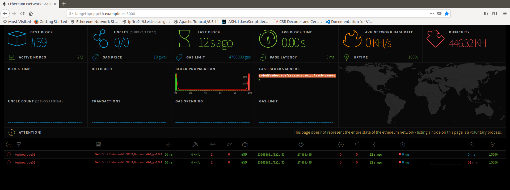

#### En la consola de administración del nodo 01 `labgethnode01`:

```sh
devel1@labgethnode01:~$ geth attach ~/ethtestnet/geth.ipc
Welcome to the Geth JavaScript console!

instance: Geth/testnetnode01/v1.8.2-stable-b8b9f7f4/linux-amd64/go1.9.4
coinbase: 0xd0df65de6c9b8fa9521935c3611df13cb4895802
at block: 228 (Fri, 27 Apr 2018 17:45:10 CEST)
 datadir: /home/devel1/ethtestnet
 modules: admin:1.0 debug:1.0 eth:1.0 miner:1.0 net:1.0 personal:1.0 rpc:1.0 txpool:1.0 web3:1.0

> admin.nodeInfo
{
  enode: "enode://a287571096d9e7db06f9ae77cd3a59ce2418775c5b39708a9af1ffe4e61c047e0367f466a17858c7db9d84c87809a658cc79e28be72f91deff718204a2c28bf2@[::]:30311",
  id: "a287571096d9e7db06f9ae77cd3a59ce2418775c5b39708a9af1ffe4e61c047e0367f466a17858c7db9d84c87809a658cc79e28be72f91deff718204a2c28bf2",
  ip: "::",
  listenAddr: "[::]:30311",
  name: "Geth/testnetnode01/v1.8.2-stable-b8b9f7f4/linux-amd64/go1.9.4",
  ports: {
    discovery: 30311,
    listener: 30311
  },
  protocols: {
    eth: {
      config: {
        byzantiumBlock: 4,
        chainId: 15936,
        eip150Block: 2,
        eip150Hash: "0x0000000000000000000000000000000000000000000000000000000000000000",
        eip155Block: 3,
        eip158Block: 3,
        ethash: {},
        homesteadBlock: 1
      },
      difficulty: 104129936,
      genesis: "0xf2045534f8547de360448f8e2b0aebd8983f87cdeab1d8148332782b9e4e6204",
      head: "0x19bea1bcbdbe2dd947730ab04c694268e7abfcb928b8cf73424f072f62ae3eab",
      network: 15936
    }
  }
}
> admin.peers
[{
    caps: ["eth/62", "eth/63"],
    id: "ddad4982ee649e61e5e5eeef357a36c64784abbc9ac569b59e1453a0dbb1ce14e2ef0ae0079361a5e4f505ab7a2e0864222bd3d0f95cc5280d7e2c95e1fd559f",
    name: "Geth/testnetnode02/v1.8.2-stable-b8b9f7f4/linux-amd64/go1.9.4",
    network: {
      inbound: true,
      localAddress: "10.0.0.21:30311",
      remoteAddress: "10.0.0.22:36278",
      static: false,
      trusted: false
    },
    protocols: {
      eth: {
        difficulty: 105950970,
        head: "0xb3248f27b006eb188c28fea834e6fe1d4b9b308c40c11709e0e705ed89263386",
        version: 63
      }
    }
}]
> eth.mining
true
```

```

#### En la consola de administración del nodo 02 `labgethnode02`:

```sh
devel1@labgethnode02:~$ geth attach ~/ethtestnet/geth.ipc
Welcome to the Geth JavaScript console!

instance: Geth/testnetnode02/v1.8.2-stable-b8b9f7f4/linux-amd64/go1.9.4
coinbase: 0xd4a6dced76798668672ce8181b9a6855dd6da50e
at block: 104 (Fri, 27 Apr 2018 17:27:32 CEST)
 datadir: /home/devel1/ethtestnet
 modules: admin:1.0 debug:1.0 eth:1.0 miner:1.0 net:1.0 personal:1.0 rpc:1.0 txpool:1.0 web3:1.0

> admin.nodeInfo
{
  enode: "enode://ddad4982ee649e61e5e5eeef357a36c64784abbc9ac569b59e1453a0dbb1ce14e2ef0ae0079361a5e4f505ab7a2e0864222bd3d0f95cc5280d7e2c95e1fd559f@[::]:30311",
  id: "ddad4982ee649e61e5e5eeef357a36c64784abbc9ac569b59e1453a0dbb1ce14e2ef0ae0079361a5e4f505ab7a2e0864222bd3d0f95cc5280d7e2c95e1fd559f",
  ip: "::",
  listenAddr: "[::]:30311",
  name: "Geth/testnetnode02/v1.8.2-stable-b8b9f7f4/linux-amd64/go1.9.4",
  ports: {
    discovery: 30311,
    listener: 30311
  },
  protocols: {
    eth: {
      config: {
        byzantiumBlock: 4,
        chainId: 15936,
        eip150Block: 2,
        eip150Hash: "0x0000000000000000000000000000000000000000000000000000000000000000",
        eip155Block: 3,
        eip158Block: 3,
        ethash: {},
        homesteadBlock: 1
      },
      difficulty: 47925770,
      genesis: "0xf2045534f8547de360448f8e2b0aebd8983f87cdeab1d8148332782b9e4e6204",
      head: "0x4a1c3bca3e0da504baf2821191bb1920e49b3d22dd286f5ddb29134d765dcdf8",
      network: 15936
    }
  }
}
> admin.peers
[{
    caps: ["eth/62", "eth/63"],
    id: "a287571096d9e7db06f9ae77cd3a59ce2418775c5b39708a9af1ffe4e61c047e0367f466a17858c7db9d84c87809a658cc79e28be72f91deff718204a2c28bf2",
    name: "Geth/testnetnode01/v1.8.2-stable-b8b9f7f4/linux-amd64/go1.9.4",
    network: {
      inbound: false,
      localAddress: "10.0.0.22:36278",
      remoteAddress: "10.0.0.21:30311",
      static: false,
      trusted: false
    },
    protocols: {
      eth: {
        difficulty: 88698831,
        head: "0x97eb4551554861e931e6052901d7d3bcdfc1108e81fcbf2c1e3cd3a203c9778a",
        version: 63
      }
    }
}]
```


#### Prueba JSON-RPC

```sh
devel1@labgethnode01:~$ curl -X POST -H"Content-Type: application/json" --data '{"jsonrpc":"2.0","method":"web3_clientVersion","params":[],"id":67}' http://localhost:8501
{"jsonrpc":"2.0","id":67,"result":"Geth/testnetnode01/v1.8.2-stable-b8b9f7f4/linux-amd64/go1.9.4"}
```

```sh
devel1@labgethnode02:~$ curl -X POST -H"Content-Type: application/json" --data '{"jsonrpc":"2.0","method":"web3_clientVersion","params":[],"id":67}' http://localhost:8501
{"jsonrpc":"2.0","id":67,"result":"Geth/testnetnode02/v1.8.2-stable-b8b9f7f4/linux-amd64/go1.9.4"}
```


### Configuración de Metamask en el Chromium browser del nodo 01 `labgethnode01`

>Nota: por un de bug metamask al importar cuentas desde JSON file se cierra el pop-up. 
>para solucionarlo hay que forzar la salida del pop-up como una pestaña nueva con
>[chrome-extension://nkbihfbeogaeaoehlefnkodbefgpgknn/popup.html](chrome-extension://nkbihfbeogaeaoehlefnkodbefgpgknn/popup.html)

#### Importar cuentas en MetaMask:

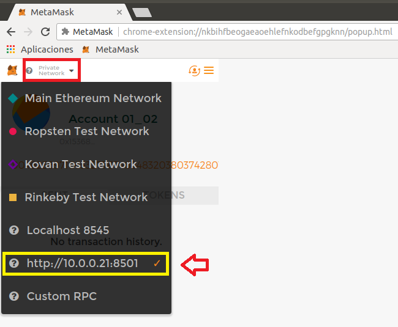
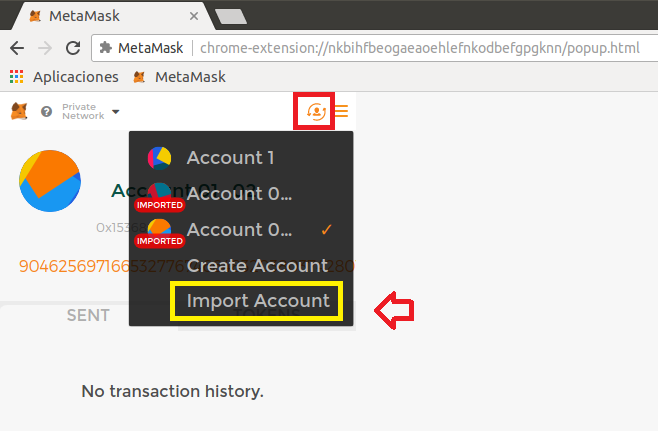
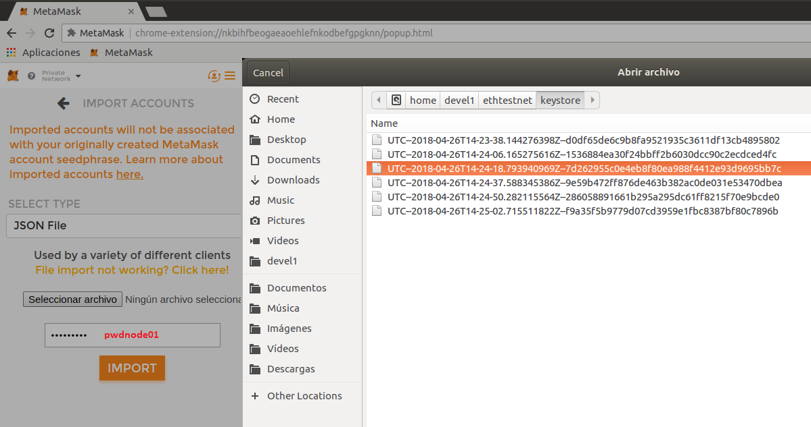
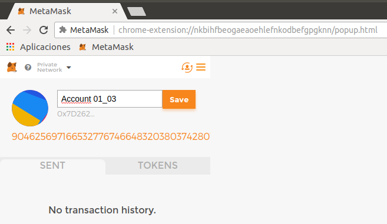

>Nota: adviértase el saldo desorbitado de `ethers` al tratarse de cuentas que recibieron un `alloc` en el `Génesis Block`


#### Las nuevas cuentas en el nodo 01 se crean con saldo 0 pues sólo las que se les hizo `alloc` en el `Genesis Block` tendrán saldo inicial.

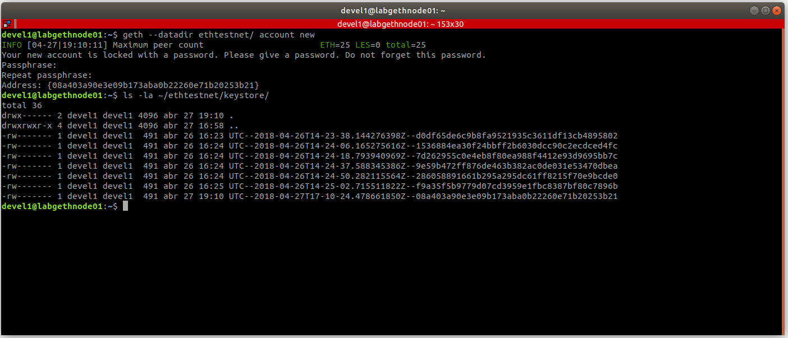

```sh

devel1@labgethnode01:~$ geth --datadir ethtestnet/ account new
INFO [04-27|19:10:11] Maximum peer count                       ETH=25 LES=0 total=25
Your new account is locked with a password. Please give a password. Do not forget this password.
Passphrase: (pwdnode01)
Repeat passphrase: 
Address: {08a403a90e3e09b173aba0b22260e71b20253b21}

devel1@labgethnode01:~$ geth --datadir ethtestnet/ account new
INFO [04-27|19:10:11] Maximum peer count                       ETH=25 LES=0 total=25
Your new account is locked with a password. Please give a password. Do not forget this password.
Passphrase: (pwdnode01)
Repeat passphrase: 
Address: {a4c27baee78d565475c2e29586763d33d51d417a}

devel1@labgethnode01:~$ ls -la ~/ethtestnet/keystore/
total 40
drwx------ 2 devel1 devel1 4096 abr 27 19:19 .
drwxrwxr-x 4 devel1 devel1 4096 abr 27 16:58 ..
-rw------- 1 devel1 devel1  491 abr 26 16:23 UTC--2018-04-26T14-23-38.144276398Z--d0df65de6c9b8fa9521935c3611df13cb4895802
-rw------- 1 devel1 devel1  491 abr 26 16:24 UTC--2018-04-26T14-24-06.165275616Z--1536884ea30f24bbff2b6030dcc90c2ecdced4fc
-rw------- 1 devel1 devel1  491 abr 26 16:24 UTC--2018-04-26T14-24-18.793940969Z--7d262955c0e4eb8f80ea988f4412e93d9695bb7c
-rw------- 1 devel1 devel1  491 abr 26 16:24 UTC--2018-04-26T14-24-37.588345386Z--9e59b472ff876de463b382ac0de031e53470dbea
-rw------- 1 devel1 devel1  491 abr 26 16:24 UTC--2018-04-26T14-24-50.282115564Z--286058891661b295a295dc61ff8215f70e9bcde0
-rw------- 1 devel1 devel1  491 abr 26 16:25 UTC--2018-04-26T14-25-02.715511822Z--f9a35f5b9779d07cd3959e1fbc8387bf80c7896b
-rw------- 1 devel1 devel1  491 abr 27 19:10 UTC--2018-04-27T17-10-24.478661850Z--08a403a90e3e09b173aba0b22260e71b20253b21
-rw------- 1 devel1 devel1  491 abr 27 19:19 UTC--2018-04-27T17-19-56.205860209Z--a4c27baee78d565475c2e29586763d33d51d417a

devel1@labgethnode01:~$ geth attach ~/ethtestnet/geth.ipc
Welcome to the Geth JavaScript console!

instance: Geth/testnetnode01/v1.8.2-stable-b8b9f7f4/linux-amd64/go1.9.4
coinbase: 0xd0df65de6c9b8fa9521935c3611df13cb4895802
at block: 899 (Fri, 27 Apr 2018 19:20:10 CEST)
 datadir: /home/devel1/ethtestnet
 modules: admin:1.0 debug:1.0 eth:1.0 miner:1.0 net:1.0 personal:1.0 rpc:1.0 txpool:1.0 web3:1.0
exit

> eth.accounts
["0xd0df65de6c9b8fa9521935c3611df13cb4895802", "0x1536884ea30f24bbff2b6030dcc90c2ecdced4fc", "0x7d262955c0e4eb8f80ea988f4412e93d9695bb7c", "0x9e59b472ff876de463b382ac0de031e53470dbea", "0x286058891661b295a295dc61ff8215f70e9bcde0", "0xf9a35f5b9779d07cd3959e1fbc8387bf80c7896b", "0x08a403a90e3e09b173aba0b22260e71b20253b21", "0xa4c27baee78d565475c2e29586763d33d51d417a"]
> eth.getBalance(eth.accounts[0])
9.04625697166532776746648320380374280103671755200316907826606125061821325312e+74
> eth.getBalance(eth.accounts[6])
0
> eth.getBalance(eth.accounts[7])
0

```

#### Vease por ejemplo la cuenta importada en MetaMask:

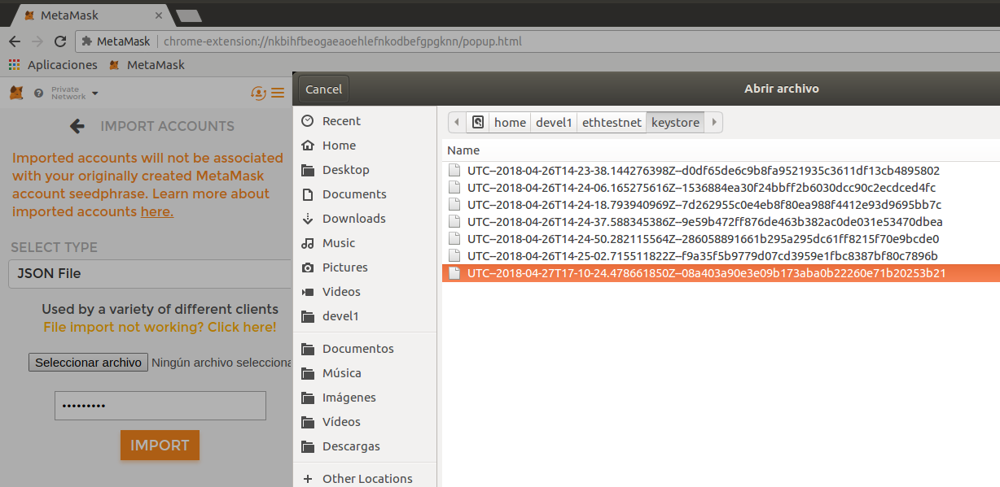
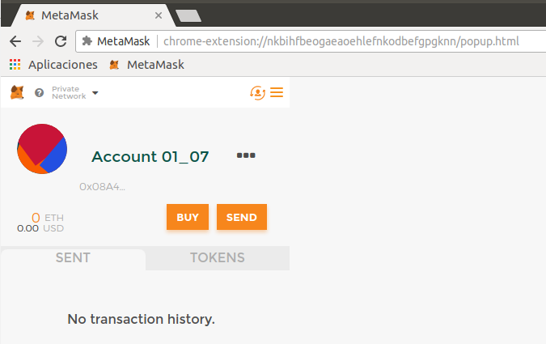